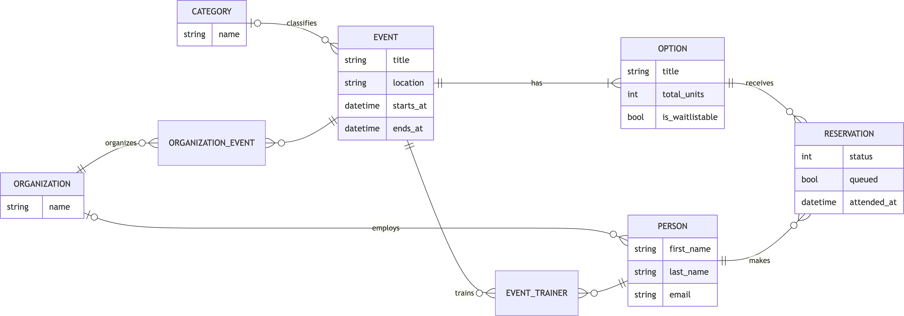
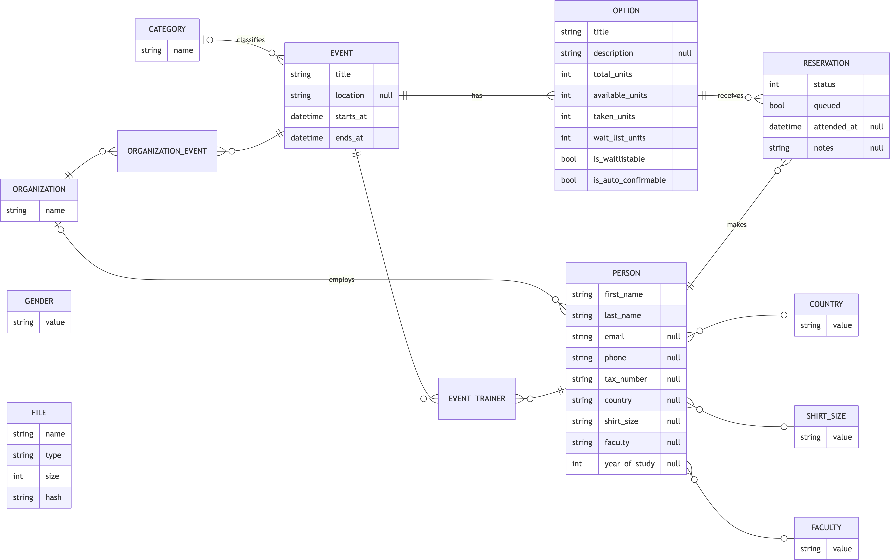
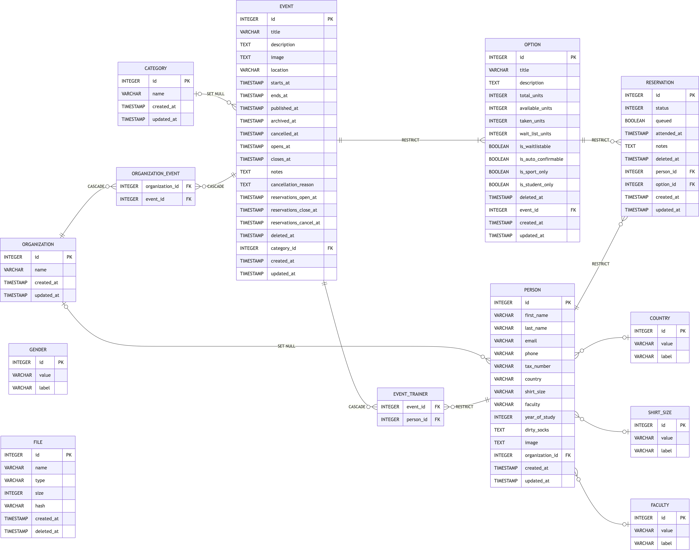
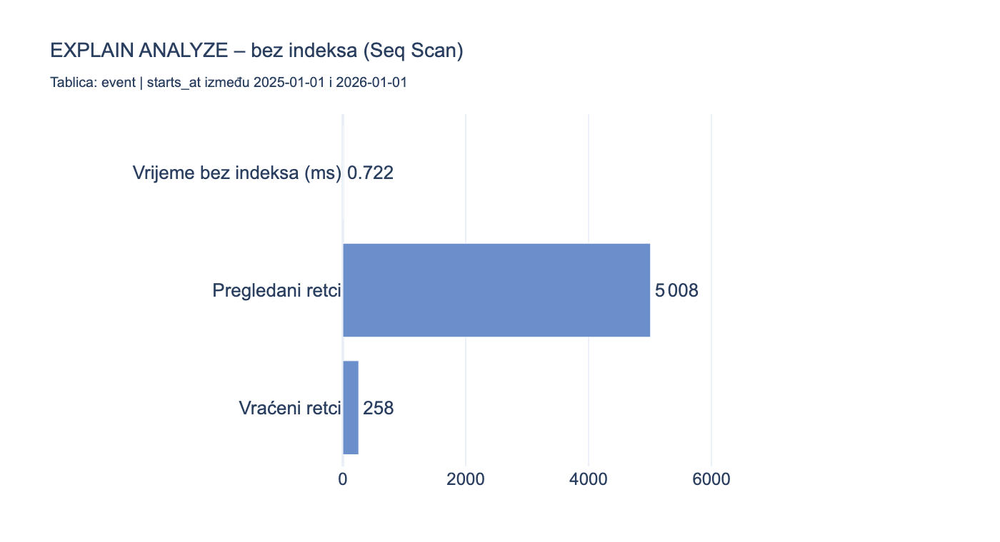
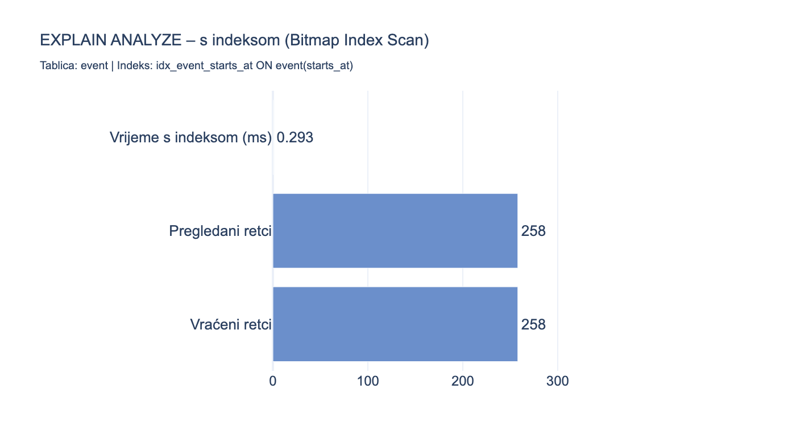

<style>
@page {
  size: A4;
  margin: 2cm;
  @bottom-center {
    content: counter(page);
    font-size: 10pt;
    font-family: serif;
  }
}
@page cover {
  @bottom-center { content: none; }
}
@page toc-page {
  @bottom-center { content: none; }
}
.cover-page {
  page: cover;
  page-break-after: always;
}
.cover-page table {
  display: table;
  width: 100%;
  overflow-x: visible;
}
.cover-page td {
  border: none !important;
}
.toc-section {
  page: toc-page;
}
.toc ul {
  list-style: none;
  padding-left: 1.5em;
}
.toc > ul {
  padding-left: 0;
}
.no-borders td, .no-borders th {
  border: none !important;
}
</style>

<div class="cover-page">
<p style="text-align:center; margin:0">
<strong>SVEUČILIŠTE U SPLITU</strong><br>
<strong>PRIRODOSLOVNO-MATEMATIČKI FAKULTET</strong>
</p>
<p style="text-align:center; margin:9cm 0 0 0">
SEMINARSKI RAD<br>
<strong>INFORMATIČKI PROJEKT IZ BAZA PODATAKA</strong>
</p>
<div style="margin-top:10cm">
<table style="width:100%; border-collapse:collapse;">
<tr>
<td style="border:none; width:50%; vertical-align:top">Profesorica:<br><strong>Monika Mladenović</strong></td>
<td style="border:none; width:50%; text-align:right; vertical-align:top">Student:<br><strong>Dražen Barić</strong></td>
</tr>
</table>
<p style="text-align:center; margin:0.8cm 0 0 0">Split, travanj 2026.</p>
</div>
</div>

<div class="toc-section">

## Sadržaj

<div class="toc">

- 1 Uvod
  - 1.1 Općenito
  - 1.2 Opis projekta
- 2 Konceptualni model
  - 2.1 Popis entiteta
  - 2.2 Detaljan opis entiteta
    - 2.2.1 Event
    - 2.2.2 Option
    - 2.2.3 Reservation
    - 2.2.4 Person
    - 2.2.5 Organization
    - 2.2.6 Category
    - 2.2.7 File
    - 2.2.8 Gender
    - 2.2.9 Country
    - 2.2.10 ShirtSize
    - 2.2.11 Faculty
    - 2.2.12 OrganizationEvent
    - 2.2.13 EventTrainer
  - 2.3 Normalizacija
    - Normalna forma modela
    - Svjesna odstupanja od normalizacijskih načela
  - 2.4 Konceptualni dijagram
- 3 Relacije
  - 3.1 Relacija jedan na jedan (1:1)
  - 3.2 Relacija jedan na više (1:N)
  - 3.3 Relacija više na više (M:N)
- 4 Logički i relacijski model
  - 4.1 Logički model
  - 4.2 Relacijski model
- 5 Izrada baze podataka
  - 5.1 Sekvence i triggeri
    - Kategorija A: Automatski identifikatori (sekvence)
    - Kategorija B: Automatsko ažuriranje `updated_at`
    - Kategorija C: Poslovna logika kapacitetnog upravljanja
    - Ručno pokretanje i provjera triggera
  - 5.2 Schema
  - 5.3 Kreiranje korisnika i ovlasti
  - 5.4 Constraints s demonstracijom kršenja
  - 5.5 Prikaz kreiranih tablica
  - 5.6 Views
  - 5.7 Indeksi
    - Primjer 1: B-tree indeks na `event.starts_at`
    - Primjer 2: Parcijalni indeks na `starts_at` uz uvjet `deleted_at IS NULL`
  - 5.8 Raspoređene procedure
    - Invarijant koji provjeravamo
    - Implementacija
- 6 Osnovni upiti (DML)
  - 6.1 INSERT
  - 6.2 UPDATE
  - 6.3 DELETE
  - 6.4 SELECT
  - 6.5 Transakcijska konzistentnost
- 7 Složeni upiti
  - 7.1 Zadatak 1: Kategorije s brojem događaja i potvrđenih rezervacija
  - 7.2 Zadatak 2: Organizacije s barem 3 događaja u 2025. godini
  - 7.3 Zadatak 3: Iskorištenost kapaciteta putem viewa
  - 7.4 Zadatak 4: Opcije s listom čekanja i koreliranim EXISTS
  - 7.5 Zadatak 5: Profil rezervacija po osobi s CASE WHEN
- 8 Aplikacijski sloj (pgAdmin 4)
  - 8.1 Spajanje na bazu i pregled korisnika
  - 8.2 Navigacija i Query Tool
  - 8.3 Pregled i uređivanje jednostavnih tablica
  - 8.4 Pregled nadređenih i podređenih entiteta
- 9 Zaključak
- Literatura

</div>

<div style="page-break-after:always; counter-reset: page 0"></div>

</div>

## 1 Uvod

### 1.1 Općenito

Sustav za rezervaciju sportskih aktivnosti za studente Sveučilišta u Splitu u sklopu projekta Unisport Health. Projekt organizira Hrvatski akademski sportski savez (HASS), a aplikacija je uvedena u sklopu Splitskog akademskog sportskog saveza (SASS) i Unispota. Platforma zamjenjuje nekadašnju godišnju registraciju studenata za sportske programe fleksibilnim, on-demand modelom rezerviranja: studenti biraju konkretne događaje, upisuju se na opcije s ograničenim kapacitetima i prate status svojih rezervacija u stvarnom vremenu.

<table class="no-borders" style="width:100%; table-layout:fixed; border-collapse:collapse;">
<tr>
<td style="width:33%; text-align:center; border:none; padding:8px"></td>
<td style="width:33%; text-align:center; border:none; padding:8px"></td>
<td style="width:33%; text-align:center; border:none; padding:8px"></td>
</tr>
<tr>
<td style="width:33%; text-align:center; border:none"><strong>Split Academic Sports Association</strong></td>
<td style="width:33%; text-align:center; border:none"><strong>Croatian Academic Sports Federation</strong></td>
<td style="width:33%; text-align:center; border:none"><strong>Unispot</strong></td>
</tr>
</table>

Domena je po prirodi višestruko pogodna za relacijsku bazu podataka. Svaki sportski događaj organizira jedna ili više udruga (odnos više-na-više), ima jednu ili više opcija sudjelovanja s odvojenim kapacitetima, a studenti mogu napraviti više rezervacija za različite događaje, što znači visoku frekvenciju pisanja i čitanja s nužnim referentnim integritetom. Kapacitetno upravljanje (slobodna mjesta, zauzeta mjesta, lista čekanja) zahtijeva konzistentnost koja se teško garantira na razini aplikacije bez potpore baze podataka u obliku triggera (automatiziranih pravila koja se izvršavaju pri promjeni podataka) i transakcija (skupova operacija koje ili sve prolaze ili se sve poništavaju). Evidencija prisutnosti, praćenje statusa rezervacije i soft-delete (logičko brisanje postavljanjem timestampa umjesto fizičkog uklanjanja retka) za arhivirane događaje dodatni su elementi koji upućuju na strukturirani model pohrane.

Korisnici sustava dijele se u tri uloge. Studenti pregledavaju dostupne sportske događaje i upućuju rezervacije za opcije po svom odabiru. Treneri su pridruženi događajima kao vanjski suradnici i nemaju administracijska prava, ali mogu voditi evidenciju prisutnosti. Administratori organizacija kreiraju i upravljaju događajima.

### 1.2 Opis projekta

Sustav je definiran sljedećim funkcionalnim zahtjevima:

1. Korisnik mora moći pregledati dostupne sportske događaje filtrirane po kategoriji i datumu.
2. Sustav mora voditi evidenciju o rezervacijama s praćenjem statusa (PENDING, CONFIRMED ili CANCELLED) i prisutnosti svakog pojedinog sudionika.
3. Potrebno je upravljati kapacitetima opcija s podrškom za listu čekanja. Kada su sva redovna mjesta zauzeta, daljnje rezervacije ulaze na listu čekanja ako je to za opciju postavljeno.
4. Sustav mora bilježiti koje organizacije organiziraju koji događaj. Jedan događaj može biti zajednički projekt više organizacija (M:N veza).
5. Promjena statusa rezervacije mora konzistentno ažurirati kapacitetna polja opcije na razini baze podataka, neovisno o tome dolazi li izmjena iz aplikacijskog sloja ili direktnim SQL iskazom.

---

## 2 Konceptualni model

### 2.1 Popis entiteta

Model se sastoji od 13 entiteta raspoređenih u četiri kategorije:

1. **Organization**: predstavlja udrugu ili instituciju koja organizira sportske događaje (npr. SASS, HASS, Unisport Health).
2. **Category**: klasificira sportske događaje prema vrsti aktivnosti (Sport, Rekreacija, Zdravlje, Zabava, Kultura).
3. **Event**: središnji entitet sustava. Predstavlja jedan sportski ili rekreativni događaj s definiranim terminima, lokacijom i životnim ciklusom.
4. **Option**: podređeni entitet Event-a koji definira jednu varijantu sudjelovanja s odvojenim kapacitetom (npr. jutarnji termin, večernji termin, lista čekanja).
5. **Reservation**: razrješava M:N vezu između Person i Option uz nošenje atributa: status rezervacije, evidencija prisutnosti i napomene.
6. **Person**: akter sustava koji može biti student-sudionik i/ili trener. Uloga trenera pretpostavlja dodijeljenu organizaciju. Ima jednu primarnu organizacijsku pripadnost.
7. **File**: pomoćni entitet za pohranu metapodataka o datotekama, namjerno bez FK (polimorfna asocijacija).
8. **Gender**: lookup tablica za kodove spola s čitljivim oznakama.
9. **Country**: lookup tablica za kodove država (ISO format).
10. **ShirtSize**: lookup tablica za veličine majica.
11. **Faculty**: lookup tablica za kratice fakulteta UNIST-a.
12. **OrganizationEvent**: razrješava M:N vezu između Organization i Event (bez dodatnih atributa).
13. **EventTrainer**: razrješava M:N vezu između Event i Person u ulozi trenera (bez dodatnih atributa).

### 2.2 Detaljan opis entiteta

#### 2.2.1 Event

Središnji entitet sustava koji predstavlja jedan sportski ili rekreativni događaj. Ima složeni životni ciklus (objava, pa arhiviranje ili otkazivanje) koji se prati preko zasebnih timestamp polja, a ne promjenom jednog statusnog broja. Soft delete (`deleted_at`) osigurava da se podaci o prošlim događajima čuvaju za potrebe izvješćivanja bez fizičkog brisanja redaka.

| Atribut                  | Tip          | Obaveznost | Napomena                                            |
| ------------------------ | ------------ | ---------- | --------------------------------------------------- |
| `id`                     | INTEGER      | NOT NULL   | PK, automatski putem sekvence                       |
| `created_at`             | TIMESTAMP    | NOT NULL   | bilježi se automatski pri INSERT-u                  |
| `updated_at`             | TIMESTAMP    | NOT NULL   | ažurira trigger kategorije B                        |
| `deleted_at`             | TIMESTAMP    | NULL       | soft delete (NULL = aktivan, filtrira se u upitima) |
| `title`                  | VARCHAR(300) | NOT NULL   | naziv događaja                                      |
| `description`            | TEXT         | NULL       | detaljan opis za studente                           |
| `image`                  | TEXT         | NULL       | putanja do naslovne slike                           |
| `location`               | VARCHAR(300) | NULL       | fizička lokacija (dvorana, stadion…)                |
| `starts_at`              | TIMESTAMP    | NOT NULL   | početak događaja                                    |
| `ends_at`                | TIMESTAMP    | NOT NULL   | kraj; CHECK: `ends_at > starts_at`                  |
| `published_at`           | TIMESTAMP    | NULL       | kada je objavljen studentima                        |
| `archived_at`            | TIMESTAMP    | NULL       | arhiviran po završetku (timestamp nastanka stanja)  |
| `cancelled_at`           | TIMESTAMP    | NULL       | otkazan (timestamp nastanka stanja)                 |
| `opens_at`               | TIMESTAMP    | NULL       | početak prozora vidljivosti                         |
| `closes_at`              | TIMESTAMP    | NULL       | kraj prozora vidljivosti                            |
| `notes`                  | TEXT         | NULL       | interne napomene administratora                     |
| `cancellation_reason`    | TEXT         | NULL       | razlog otkazivanja                                  |
| `reservations_open_at`   | TIMESTAMP    | NULL       | otvaranje rezerviranja                              |
| `reservations_close_at`  | TIMESTAMP    | NULL       | zatvaranje rezerviranja                             |
| `reservations_cancel_at` | TIMESTAMP    | NULL       | rok za besplatno otkazivanje rezervacije            |
| `category_id`            | INTEGER      | NULL       | FK na `category.id`; ON DELETE SET NULL             |

Veze: 1:N s `Option`, M:N s `Organization` (preko `OrganizationEvent`), M:N s `Person` (preko `EventTrainer`).

#### 2.2.2 Option

Podređeni entitet koji definira jednu varijantu sudjelovanja na događaju. Isti Event može imati više opcija s odvojenim kapacitetima, npr. jutarnji i večernji termin, ili standardnu opciju i opciju s listom čekanja. Kapacitetna polja (`available_units`, `taken_units`, `wait_list_units`) su izvedene vrijednosti čija se konzistentnost osigurava triggerima kategorije C (argumentacija u sekciji 2.3).

| Atribut               | Tip          | Obaveznost | Napomena                                                                   |
| --------------------- | ------------ | ---------- | -------------------------------------------------------------------------- |
| `id`                  | INTEGER      | NOT NULL   | PK                                                                         |
| `created_at`          | TIMESTAMP    | NOT NULL   |                                                                            |
| `updated_at`          | TIMESTAMP    | NOT NULL   | trigger kategorije B                                                       |
| `deleted_at`          | TIMESTAMP    | NULL       | soft delete                                                                |
| `title`               | VARCHAR(300) | NOT NULL   | naziv opcije                                                               |
| `description`         | TEXT         | NULL       |                                                                            |
| `total_units`         | INTEGER      | NOT NULL   | ukupan kapacitet; CHECK `>= 0`                                             |
| `available_units`     | INTEGER      | NOT NULL   | slobodna mjesta; izvedeno, osigurano triggerom                             |
| `taken_units`         | INTEGER      | NOT NULL   | zauzeta mjesta; izvedeno, osigurano triggerom                              |
| `wait_list_units`     | INTEGER      | NOT NULL   | na listi čekanja; izvedeno, osigurano triggerom                           |
| `is_waitlistable`     | BOOLEAN      | NOT NULL   | dopušta listu čekanja (DEFAULT FALSE)                                      |
| `is_auto_confirmable` | BOOLEAN      | NOT NULL   | rezervacija se automatski potvrđuje                                        |
| `is_sport_only`       | BOOLEAN      | NOT NULL   | vidljivo samo registriranim sportašima; privremeni/eksperimentalni boolean |
| `is_student_only`     | BOOLEAN      | NOT NULL   | vidljivo samo studentima UNIST-a; privremeni/eksperimentalni boolean       |
| `event_id`            | INTEGER      | NOT NULL   | FK na `event.id`; ON DELETE RESTRICT                                       |

Veze: N:1 s `Event`, 1:N s `Reservation`.

#### 2.2.3 Reservation

Junction entitet s atributima koji bilježi jednu konkretnu rezervaciju osobe za opciju. Za razliku od čistih junction tablica (`OrganizationEvent`, `EventTrainer`), Reservation nosi poslovne atribute: status, evidenciju prisutnosti i napomene. Tablica sadrži polje `deleted_at` (soft delete) koje je trenutno rezervirano i nije u aktivnoj upotrebi. Operativni scenarij fizičkog brisanja otkazanih rezervacija prikazan je u §6.3. Polje `queued` bilježi je li rezervacija smještena na listu čekanja. Vrijednost postavlja trigger kategorije C pri INSERT-u.

| Atribut       | Tip       | Obaveznost | Napomena                                               |
| ------------- | --------- | ---------- | ------------------------------------------------------ |
| `id`          | INTEGER   | NOT NULL   | PK                                                     |
| `created_at`  | TIMESTAMP | NOT NULL   |                                                        |
| `updated_at`  | TIMESTAMP | NOT NULL   | trigger kategorije B                                   |
| `deleted_at`  | TIMESTAMP | NULL       | soft delete (nije u aktivnoj upotrebi)                 |
| `queued`      | BOOLEAN   | NOT NULL   | TRUE = smještena na listu čekanja; postavlja trigger C |
| `status`      | INTEGER   | NOT NULL   | 0=PENDING, 1=CONFIRMED, 2=CANCELLED; CHECK IN (0,1,2)  |
| `attended_at` | TIMESTAMP | NULL       | timestamp evidencije dolaska; NULL = nije prisutan     |
| `notes`       | TEXT      | NULL       | napomene administratora                                |
| `person_id`   | INTEGER   | NOT NULL   | FK na `person.id`; ON DELETE RESTRICT                  |
| `option_id`   | INTEGER   | NOT NULL   | FK na `option.id`; ON DELETE RESTRICT                  |

Veze: N:1 s `Person`, N:1 s `Option`.

#### 2.2.4 Person

Akter sustava koji može imati tri uloge: student-sudionik (koji rezervira mjesta), trener (bilježi prisutnost) i admin (upravlja događajima). Uloga trenera pretpostavlja da osoba ima dodijeljenu organizaciju. Osobna polja `country`, `shirt_size` i `faculty` pohranjena su kao slobodni stringovi, a ne kao FK na lookup tablice. Ovo je svjesna odluka obrazložena u sekciji 2.3. Polje `dirty_socks` rezervirano je za nepoznatu vanjsku integraciju čiji zahtjevi nisu dokumentirani.

| Atribut           | Tip          | Obaveznost | Napomena                                                               |
| ----------------- | ------------ | ---------- | ---------------------------------------------------------------------- |
| `id`              | INTEGER      | NOT NULL   | PK                                                                     |
| `created_at`      | TIMESTAMP    | NOT NULL   |                                                                        |
| `updated_at`      | TIMESTAMP    | NOT NULL   | trigger kategorije B                                                   |
| `first_name`      | VARCHAR(100) | NOT NULL   |                                                                        |
| `last_name`       | VARCHAR(100) | NOT NULL   |                                                                        |
| `email`           | VARCHAR(255) | NULL       | UNIQUE, poslovni identifikator                                         |
| `phone`           | VARCHAR(30)  | NULL       |                                                                        |
| `tax_number`      | VARCHAR(20)  | NULL       | OIB; opcionalan                                                        |
| `country`         | VARCHAR(10)  | NULL       | slobodni string, nije FK na `country`                                  |
| `shirt_size`      | VARCHAR(10)  | NULL       | slobodni string, nije FK na `shirt_size`                               |
| `faculty`         | VARCHAR(20)  | NULL       | slobodni string, nije FK na `faculty`                                  |
| `year_of_study`   | INTEGER      | NULL       | CHECK BETWEEN 1 AND 8                                                  |
| `dirty_socks`     | TEXT         | NULL       | rezervirano za nepoznatu vanjsku integraciju; nije u aktivnoj upotrebi |
| `image`           | TEXT         | NULL       | URL ili base64 avatar                                                  |
| `organization_id` | INTEGER      | NULL       | FK na `organization.id`; ON DELETE SET NULL                            |

Veze: N:1 s `Organization`, 1:N s `Reservation`, M:N s `Event` (kao trener, preko `EventTrainer`).

#### 2.2.5 Organization

Entitet koji predstavlja udrugu ili instituciju odgovornu za organiziranje sportskih događaja. U sustavu su prisutne dvije organizacije: SASS i Studentski centar Split. Osobe su primarno vezane za jednu organizaciju, ali organizacija može organizirati više događaja u suradnji s drugima.

| Atribut      | Tip          | Obaveznost | Napomena                |
| ------------ | ------------ | ---------- | ----------------------- |
| `id`         | INTEGER      | NOT NULL   | PK                      |
| `created_at` | TIMESTAMP    | NOT NULL   |                         |
| `updated_at` | TIMESTAMP    | NOT NULL   | trigger kategorije B    |
| `name`       | VARCHAR(200) | NOT NULL   | puni naziv organizacije |

Veze: 1:N s `Person`, M:N s `Event` (preko `OrganizationEvent`).

#### 2.2.6 Category

Lookup entitet koji klasificira sportske događaje. Ima UNIQUE constraint na naziv što sprječava duplikate. Asocijacija s `Event` je opcionalna (FK je nullable), pa događaj može biti kreiran bez kategorije.

| Atribut      | Tip          | Obaveznost | Napomena                 |
| ------------ | ------------ | ---------- | ------------------------ |
| `id`         | INTEGER      | NOT NULL   | PK                       |
| `created_at` | TIMESTAMP    | NOT NULL   |                          |
| `updated_at` | TIMESTAMP    | NOT NULL   | trigger kategorije B     |
| `name`       | VARCHAR(100) | NOT NULL   | UNIQUE, naziv kategorije |

Veze: 1:N s `Event`.

#### 2.2.7 File

Pomoćni entitet za pohranu metapodataka o datotekama (naziv, MIME tip (standard za identifikaciju vrste datoteke, npr. `image/jpeg`), veličina, hash sadržaja datoteke). Tablica nema FK constrainta niti stupaca koji bi je vezali uz `Event`, `Person` ili `Organization`, a veza između datoteke i njenog vlasnika nije ostvarena na razini baze podataka. Potpuna implementacija zahtijevala bi ili discriminator stupce (`entity_id`, `entity_type`) u tablici `file` za polimorfnu asocijaciju (obrazac u kojemu jedan entitet može biti vezan za više različitih vrsta entiteta), ili zasebne junction tablice (`event_file`, `person_file`, `organization_file`) za referentni integritet na razini baze. Postavljanjem `deleted_at` timestampa redak se logički briše, a metapodaci ostaju u tablici.

| Atribut      | Tip          | Obaveznost | Napomena                     |
| ------------ | ------------ | ---------- | ---------------------------- |
| `id`         | INTEGER      | NOT NULL   | PK                           |
| `name`       | VARCHAR(300) | NOT NULL   | originalni naziv datoteke    |
| `type`       | VARCHAR(100) | NOT NULL   | MIME tip (npr. `image/jpeg`) |
| `size`       | INTEGER      | NOT NULL   | veličina u bajtovima         |
| `hash`       | VARCHAR(256) | NOT NULL   | hash sadržaja datoteke       |
| `created_at` | TIMESTAMP    | NOT NULL   |                              |
| `deleted_at` | TIMESTAMP    | NULL       | soft delete                  |

Veze: nema FK. Asocijacija nije ostvarena na razini baze podataka.

#### 2.2.8 Gender

Lookup tablica za kodove spola. Pohranjen je kratki kod (`value`) i čitljiva oznaka (`label`). UNIQUE constraint na `value` sprječava duplikate. Entitet postoji radi proširivosti i može primiti meta-atribute (npr. naziv na engleskom ili emoji).

Tablica `person` ne sadrži polje `gender`. Pohrana spola nije dio trenutnog modela.

| Atribut | Tip         | Obaveznost | Napomena                      |
| ------- | ----------- | ---------- | ----------------------------- |
| `id`    | INTEGER     | NOT NULL   | PK                            |
| `value` | VARCHAR(10) | NOT NULL   | UNIQUE, kratki kod (npr. `M`) |
| `label` | VARCHAR(50) | NOT NULL   | čitljivi naziv (npr. `Muško`) |

#### 2.2.9 Country

Lookup tablica za ISO kodove država (npr. `HR` = Hrvatska). Primjenjuje istu logiku kao `Gender`. Postoji radi proširivosti i nije FK na `Person`.

| Atribut | Tip          | Obaveznost | Napomena             |
| ------- | ------------ | ---------- | -------------------- |
| `id`    | INTEGER      | NOT NULL   | PK                   |
| `value` | VARCHAR(10)  | NOT NULL   | UNIQUE, ISO-3166 kod |
| `label` | VARCHAR(100) | NOT NULL   | naziv države         |

#### 2.2.10 ShirtSize

Lookup tablica za veličine majica (S, M, L, XL, XXL…). Koristi isti uzorak kao ostale lookup tablice.

| Atribut | Tip         | Obaveznost | Napomena                      |
| ------- | ----------- | ---------- | ----------------------------- |
| `id`    | INTEGER     | NOT NULL   | PK                            |
| `value` | VARCHAR(10) | NOT NULL   | UNIQUE, kratki kod (npr. `L`) |
| `label` | VARCHAR(50) | NOT NULL   | čitljivi naziv                |

#### 2.2.11 Faculty

Lookup tablica za kratice fakulteta UNIST-a (PMFST, FESB, EFST…). Radi proširivosti puni naziv (`label`) pohranjen je zasebno od kratice (`value`).

| Atribut | Tip          | Obaveznost | Napomena                       |
| ------- | ------------ | ---------- | ------------------------------ |
| `id`    | INTEGER      | NOT NULL   | PK                             |
| `value` | VARCHAR(20)  | NOT NULL   | UNIQUE, kratica (npr. `PMFST`) |
| `label` | VARCHAR(200) | NOT NULL   | puni naziv fakulteta           |

#### 2.2.12 OrganizationEvent

Čista junction tablica koja razrješava M:N vezu između `Organization` i `Event`. Nema vlastite atribute. Primarni ključ je kompozitni (`organization_id`, `event_id`). Brisanjem organizacije ili događaja automatski se brišu i odgovarajući retci (CASCADE).

| Atribut           | Tip     | Obaveznost | Napomena                                    |
| ----------------- | ------- | ---------- | ------------------------------------------- |
| `organization_id` | INTEGER | NOT NULL   | dio kompozitnog PK; FK na `organization.id` |
| `event_id`        | INTEGER | NOT NULL   | dio kompozitnog PK; FK na `event.id`        |

#### 2.2.13 EventTrainer

Čista junction tablica koja razrješava M:N vezu između `Event` i `Person` u ulozi trenera. Nema dodatnih atributa. Kompozitni PK je (`event_id`, `person_id`). Brisanjem događaja CASCADE briše i trener-vezu, ali brisanje osobe je blokirano (RESTRICT) dok je ona trener na nekom aktivnom događaju.

| Atribut     | Tip     | Obaveznost | Napomena                              |
| ----------- | ------- | ---------- | ------------------------------------- |
| `event_id`  | INTEGER | NOT NULL   | dio kompozitnog PK; FK na `event.id`  |
| `person_id` | INTEGER | NOT NULL   | dio kompozitnog PK; FK na `person.id` |

### 2.3 Normalizacija

#### Normalna forma modela

Model je oblikovan u **trećoj normalnoj formi (3NF)**. Za svaku tablicu vrijedi: atributi ovise isključivo o primarnom ključu (1NF), nema parcijalne ovisnosti atributa o dijelu kompozitnog ključa (2NF), te nema tranzitivnih ovisnosti između neključnih atributa (3NF).

#### Svjesna odstupanja od normalizacijskih načela

Model sadrži tri svjesna odstupanja od stroge 3NF primjene, svako dokumentirano s razlogom i mehanizmom konzistentnosti:

**1. Izvedene kapacitetne vrijednosti u `Option`**

Atributi `available_units`, `taken_units` i `wait_list_units` **redundantni su izvedeni podaci**: iste informacije mogu se u svakom trenutku izračunati agregacijom iz tablice `reservation` (`COUNT(*)` s odgovarajućim filterima). Pohrana tih vrijednosti kao fizičkih stupaca predstavlja **denormalizaciju** (svjesno odstupanje od načela jedinstvenosti pohrane), a ne kršenje 3NF. 3NF se odnosi na tranzitivne ovisnosti između neključnih atributa unutar iste relacije, a te vrijednosti unutar tablice `option` ovise direktno o primarnom ključu `id`.

Razlog za denormalizaciju je performans: svako učitavanje stranice događaja zahtijeva prikaz slobodnih mjesta, a izračun iz tablice `reservation` pri svakom čitanju bio bi skup za opcije s tisućama rezervacija. Konzistentnost se garantira triggerima kategorije C (sekcija 5.1): svaki INSERT i svaka promjena statusa u tablici `reservation` atomarno ažurira odgovarajuća polja u `option`. Direktni UPDATE kapacitetnih polja bez prolaza kroz trigger nije predviđen u normalnom toku aplikacije.

**2. Slobodni stringovi za `Person.country`, `Person.shirt_size`, `Person.faculty`**

Ova tri polja pohranjena su kao slobodni VARCHAR stringovi, a ne kao FK na lookup tablice `Country`, `ShirtSize` i `Faculty`. Razlog: za produkcijsku upotrebu u mobilnoj aplikaciji fleksibilnost unosa bila je prioritet: korisnici mogu upisati vrijednosti koje nisu preddefinirane. Lookup tablice postoje radi administracije i standardizacije, ali su namjerno odvojene od `Person` kako uvođenje nove vrijednosti u lookup ne bi zahtijevalo migraciju podataka u `person`.

**3. Lookup tablice kao zasebni entiteti umjesto CHECK constrainta**

Alternativa za `Gender`, `Country`, `ShirtSize` i `Faculty` bila bi jednostavni CHECK constrainti (npr. `CHECK (shirt_size IN ('S', 'M', 'L', 'XL'))`). Odabrani pristup sa zasebnim entitetima opravdan je proširivošću: dodavanje nove veličine majice zahtijeva jednu INSERT naredbu, a ne schema promjenu i migraciju na produkcijskom serveru. Pored toga, lookup tablice mogu s vremenom dobiti meta-atribute (npr. naziv na engleskom, ikona, redoslijed prikaza) što nije moguće uz CHECK pristup.

### 2.4 Konceptualni dijagram

Konceptualni dijagram prikazuje svih 13 entiteta modela, njihove atribute i kardinalnost veza, bez tipova podataka i FK kolona koji su specifični za fizički model.



_Slika 1. Konceptualni dijagram UNIST rezervacijskog sustava, Crow's Foot notacija_

---

## 3 Relacije

Relacijska baza podataka razlikuje tri tipa veza između entiteta prema kardinalnosti:

- **1:1 (jedan na jedan):** svakom retku entiteta A odgovara najviše jedan redak u entitetu B i obratno. Uvodi se FK-om s UNIQUE constraintom ili spajanjem u jednu tablicu.
- **1:N (jedan na više):** jednom retku entiteta A može odgovarati više redaka entiteta B, ali svaki redak B vezan je za točno jedan redak A. Uvodi se FK-om u tablici N strane.
- **M:N (više na više):** jednom retku A može odgovarati više redaka B i obratno. Zahtijeva junction tablicu s kompozitnim PK od FK-ova obaju entiteta.

### 3.1 Relacija jedan na jedan (1:1)

U ovom modelu relacija tipa 1:1 nije primijenjena. Razlozi su sljedeći:

- Entitet `Person` nema zasebni entitet "profil" jer su svi atributi koji opisuju osobu (kontakt podaci, fakultet, veličina majice, organizacijska pripadnost) logično smješteni na isti redak. Razdvajanje bi bilo nepotrebna fragmentacija bez funkcionalne koristi.
- Entitet `Event` nema zasebni entitet "detalji" jer svi atributi koji opisuju događaj (lokacija, životni ciklus, vremenski prozori) čine jednu semantičku cjelinu. 1:1 split opravdan je samo kada podskup atributa ima različitu frekvenciju čitanja ili različite sigurnosne zahtjeve, što ovdje nije slučaj.

### 3.2 Relacija jedan na više (1:N)

Relacija 1:N osnova je referentnog integriteta modela. FK uvijek se nalazi na tablici s N strane. Model sadrži pet takvih veza:

| Tablica 1 (1 strana) | Tablica N (N strana) | FK kolona                | ON DELETE | Opis                                                                                             |
| -------------------- | -------------------- | ------------------------ | --------- | ------------------------------------------------------------------------------------------------ |
| `category`           | `event`              | `event.category_id`      | SET NULL  | Jedna kategorija klasificira više događaja. FK je nullable, pa događaj može biti bez kategorije. |
| `organization`       | `person`             | `person.organization_id` | SET NULL  | Jedna organizacija zapošljava više osoba. FK je nullable, pa osoba može biti bez organizacije.   |
| `event`              | `option`             | `option.event_id`        | RESTRICT  | Jedan događaj ima jednu ili više opcija. Nije moguće obrisati event dok ima opcija.              |
| `option`             | `reservation`        | `reservation.option_id`  | RESTRICT  | Jedna opcija nosi više rezervacija. Nije moguće obrisati opciju dok ima rezervacija.             |
| `person`             | `reservation`        | `reservation.person_id`  | RESTRICT  | Jedna osoba može imati više rezervacija. Nije moguće obrisati osobu dok ima rezervacija.         |

Nullable FK (SET NULL ponašanje) koristi se za opcijske veze: brisanje referencirane tablice ne briše podatke u zavisnoj tablici. RESTRICT dolazi tamo gdje zavisni zapisi čine brisanje roditeljskog retka nesigurnim bez prethodne provjere.

### 3.3 Relacija više na više (M:N)

Relacijski model ne može pohraniti M:N vezu direktno bez junction tablice. Da bi se "jednoj organizaciji više događaja" pohranilo u jednu tablicu bez junction tablice, trebalo bi ili pohraniti više vrijednosti u jednoj koloni (narušavanje atomarnosti, kršenje 1NF) ili kreirati ponavljajuće grupe kolona (`event_id_1`, `event_id_2`, …) što je također kršenje 1NF. Standardno rješenje je junction tablica s kompozitnim primarnim ključem koji čine FK-ovi prema objema stranama veze.

Model sadrži dvije čiste junction tablice:

| Entitet A      | Entitet B | Junction tablica     | Kompozitni PK                  | Atributi |
| -------------- | --------- | -------------------- | ------------------------------ | -------- |
| `organization` | `event`   | `organization_event` | `organization_id` + `event_id` | nema     |
| `event`        | `person`  | `event_trainer`      | `event_id` + `person_id`       | nema     |

**Napomena o `Reservation`:** Entitet `Reservation` tehnički razrješava M:N vezu između `Person` i `Option` (jedna osoba može rezervirati više opcija, jedna opcija može imati više rezervacija). Za razliku od `OrganizationEvent` i `EventTrainer`, `Reservation` nije čista junction tablica jer nosi poslovne atribute (`status`, `attended_at`, `notes`) koji su specifični za pojedinu vezu. Takav entitet naziva se **junction entitet s atributima** i modelira se zasebnom tablicom s autoincrement PK-om, a ne samo kompozitnim ključem.

## 4 Logički i relacijski model

Logički i relacijski dijagrami razrađuju konceptualni model dodavanjem tehničkih detalja potrebnih za fizičku izradu baze.

### 4.1 Logički model

Logički model prikazuje entitete, atribute (s imenima) i kardinalnost veza, uz naznaku obaveznosti (NOT NULL nasuprot nullable atributima). Za razliku od relacijskog dijagrama, logički model ne prikazuje tipove podataka ni FK kolone. Ti su detalji specifični za konkretnu platformu.



_Slika 2. Logički model UNIST rezervacijskog sustava, Crow's Foot notacija_

Dijagram prikazuje sve odnose opisane u sekciji 3: pet 1:N veza s označenom opcionalnosti, dvije čiste M:N junction tablice i `Reservation` kao junction entitet s atributima.

### 4.2 Relacijski model

Relacijski model proširuje logički model dodavanjem tipova podataka, FK kolona i ON DELETE ponašanja za ključne veze. Ovaj dijagram izravno odgovara fizičkom schema-u u PostgreSQL-u.



_Slika 3. Relacijski model UNIST rezervacijskog sustava, s tipovima i FK kolonama_

Ključne FK odluke prikazane su u sljedećoj tablici:

| FK relacija                          | ON DELETE | Razlog                                                           |
| ------------------------------------ | --------- | ---------------------------------------------------------------- |
| `event.category_id`                  | SET NULL  | Brisanje kategorije ne briše događaje. Kategorija je opcionalna. |
| `option.event_id`                    | RESTRICT  | Ne briše se event dok ima opcija                                 |
| `reservation.option_id`              | RESTRICT  | Ne briše se opcija dok ima rezervacija                           |
| `reservation.person_id`              | RESTRICT  | Ne briše se osoba dok ima rezervacija                            |
| `person.organization_id`             | SET NULL  | Odlazak iz organizacije ne briše osobu                           |
| `organization_event.organization_id` | CASCADE   | Brisanje org. uklanja njezine event-linkove                      |
| `organization_event.event_id`        | CASCADE   | Brisanje eventa uklanja org-linkove                              |
| `event_trainer.event_id`             | CASCADE   | Brisanje eventa uklanja trener-linkove                           |
| `event_trainer.person_id`            | RESTRICT  | Ne briše se osoba dok je trener na nekom eventu                  |

---

## 5 Izrada baze podataka

### 5.1 Sekvence i triggeri

Baza podataka koristi tri kategorije triggera koji pokrivaju automatizaciju ID-ova, ažuriranje vremenske oznake izmjene i poslovnu logiku kapacitetnog upravljanja.

#### Kategorija A: Automatski identifikatori (sekvence)

Ovaj projekt koristi eksplicitne sekvence za generiranje auto-increment vrijednosti (`CREATE SEQUENCE … NEXTVAL`), umjesto skraćenog tipa `SERIAL` (PostgreSQL skratica za auto-increment cjelobrojni stupac s automatski kreiranom sekvencom), radi jasnoće mehanizma i kompatibilnosti s Oracle-stilom upravljanja sekvencama. U PostgreSQL-u sekvenca se dodjeljuje izravno putem `DEFAULT nextval(...)` u definiciji kolone, bez potrebe za posebnim BEFORE INSERT triggerom.

```sql
-- Sekvenca za tablicu event (definirana u schema.sql)
CREATE SEQUENCE IF NOT EXISTS event_seq START WITH 1 INCREMENT BY 1;

-- Dodjela u definiciji kolone:
-- id INTEGER NOT NULL DEFAULT nextval('event_seq')
--
-- PostgreSQL DEFAULT mehanizam automatski poziva nextval() pri
-- svakom INSERT-u koji ne navodi eksplicitnu vrijednost za id.
```

Isti uzorak primjenjuje se na svih 11 tablica s INTEGER PK. Primjer za tablicu `person`:

```sql
CREATE SEQUENCE IF NOT EXISTS person_seq START WITH 1 INCREMENT BY 1;
-- id INTEGER NOT NULL DEFAULT nextval('person_seq')
```

Analogno vrijedi za: `organization`, `category`, `option`, `reservation`, `file`, `gender`, `country`, `shirt_size`, `faculty`.

#### Kategorija B: Automatsko ažuriranje `updated_at`

Jedna zajednička PL/pgSQL (proceduralni jezik PostgreSQL-a koji nadopunjuje SQL varijablama, petljama i uvjetima) funkcija koristi se za sve tablice koje imaju `updated_at` polje. Time se izbjegava dupliciranje iste logike.

```sql
CREATE OR REPLACE FUNCTION set_updated_at()
RETURNS TRIGGER AS $$
BEGIN
    NEW.updated_at := NOW();
    RETURN NEW;
END;
$$ LANGUAGE plpgsql;
```

Unutar funkcije, `NEW` je posebna varijabla koja predstavlja redak koji se upravo upisuje ili mijenja. Trigger može mijenjati njezine atribute prije nego baza izvrši operaciju. Triggeri koji pozivaju ovu funkciju definiraju se za svaku tablicu:

```sql
CREATE TRIGGER event_updated_at
BEFORE UPDATE ON event
FOR EACH ROW EXECUTE FUNCTION set_updated_at();

CREATE TRIGGER option_updated_at
BEFORE UPDATE ON option
FOR EACH ROW EXECUTE FUNCTION set_updated_at();

CREATE TRIGGER reservation_updated_at
BEFORE UPDATE ON reservation
FOR EACH ROW EXECUTE FUNCTION set_updated_at();

CREATE TRIGGER person_updated_at
BEFORE UPDATE ON person
FOR EACH ROW EXECUTE FUNCTION set_updated_at();

CREATE TRIGGER organization_updated_at
BEFORE UPDATE ON organization
FOR EACH ROW EXECUTE FUNCTION set_updated_at();

CREATE TRIGGER category_updated_at
BEFORE UPDATE ON category
FOR EACH ROW EXECUTE FUNCTION set_updated_at();
```

#### Kategorija C: Poslovna logika kapacitetnog upravljanja

Ova kategorija triggera osigurava konzistentnost deriviranih kapacitetnih polja u tablici `option` (argumentirana u sekciji 2.3). Dva triggera pokrivaju sve relevantne scenarije.

**C1+C2: BEFORE INSERT na `reservation`, provjera kapaciteta, ažuriranje i postavljanje `queued` zastavice**

C1 i C2 spojeni su u jedan BEFORE INSERT trigger jer BEFORE trigger može mijenjati `NEW` redak (postaviti `queued`) i ažurirati `option` u istoj operaciji. Zaključavanje retka (`FOR UPDATE`) sprječava race condition (situacija u kojoj dva istovremena zahtjeva čitaju isto stanje i oba zaključuju da ima slobodnih mjesta, pa oba uspiju rezervirati zadnje mjesto).

```sql
CREATE OR REPLACE FUNCTION enforce_option_capacity()
RETURNS TRIGGER AS $$
DECLARE
    v_available    INTEGER;
    v_waitlistable BOOLEAN;
BEGIN
    -- Zaključati redak opcije radi sprječavanja race conditiona
    SELECT available_units, is_waitlistable
    INTO   v_available, v_waitlistable
    FROM   option
    WHERE  id = NEW.option_id
    FOR UPDATE;

    -- Blokiraj INSERT ako nema mjesta ni liste čekanja
    IF v_available <= 0 AND NOT v_waitlistable THEN
        RAISE EXCEPTION
            'Opcija % je popunjena i ne podržava listu čekanja.',
            NEW.option_id;
    END IF;

    IF v_available > 0 THEN
        -- Ima slobodnih mjesta — redovno mjesta
        UPDATE option
        SET    taken_units     = taken_units + 1,
               available_units = GREATEST(available_units - 1, 0)
        WHERE  id = NEW.option_id;
        NEW.queued := FALSE;
    ELSE
        -- Nema slobodnih mjesta — lista čekanja
        UPDATE option
        SET    wait_list_units = wait_list_units + 1
        WHERE  id = NEW.option_id;
        NEW.queued := TRUE;
    END IF;

    RETURN NEW;
END;
$$ LANGUAGE plpgsql;

CREATE TRIGGER reservation_enforce_capacity
BEFORE INSERT ON reservation
FOR EACH ROW EXECUTE FUNCTION enforce_option_capacity();
```

**C3: AFTER UPDATE na `reservation`, promjena statusa**

Polje `OLD.queued` koristi se za određivanje tipa rezervacije (regularno mjesto ili lista čekanja), što određuje koji se brojač smanjuje pri otkazivanju. `OLD` je varijabla simetrična s `NEW`: sadrži stanje retka kakvo je bilo prije UPDATE-a, dok `NEW` sadrži novo stanje. Dostupna je samo u AFTER triggerima i BEFORE UPDATE triggerima.

```sql
CREATE OR REPLACE FUNCTION sync_option_capacity()
RETURNS TRIGGER AS $$
BEGIN
    -- Otkazivanje (bilo koji status → CANCELLED=2)
    IF NEW.status = 2 AND OLD.status <> 2 THEN
        IF OLD.queued THEN
            -- Bila je na listi čekanja — osloboditi wait_list slot
            UPDATE option
            SET    wait_list_units = GREATEST(wait_list_units - 1, 0)
            WHERE  id = NEW.option_id;
        ELSE
            -- Bila je redovna rezervacija — osloboditi regularno mjesto
            UPDATE option
            SET    taken_units     = GREATEST(taken_units - 1, 0),
                   available_units = available_units + 1
            WHERE  id = NEW.option_id;
        END IF;

    -- Reaktivacija (CANCELLED → PENDING=0 ili CONFIRMED=1)
    ELSIF OLD.status = 2 AND NEW.status <> 2 THEN
        IF NEW.queued THEN
            UPDATE option
            SET    wait_list_units = wait_list_units + 1
            WHERE  id = NEW.option_id;
        ELSE
            UPDATE option
            SET    taken_units     = taken_units + 1,
                   available_units = GREATEST(available_units - 1, 0)
            WHERE  id = NEW.option_id;
        END IF;
    END IF;

    RETURN NEW;
END;
$$ LANGUAGE plpgsql;

CREATE TRIGGER reservation_sync_capacity
AFTER UPDATE ON reservation
FOR EACH ROW EXECUTE FUNCTION sync_option_capacity();
```

Triggeri kategorije C zamjenjuju i aplikacijske transakcije za izravne SQL upite.

#### Ručno pokretanje i provjera triggera

Triggeri B i C aktiviraju se implicitno pri DML operacijama. Nije ih moguće pozvati direktno. Provjera ispravnosti izvodi se usporedbom stanja tablice prije i poslije operacije.

**Trigger B: provjera ažuriranja `updated_at`**

```sql
-- Stanje PRIJE promjene
SELECT id, location, updated_at FROM event WHERE id = 1;

-- Promjena lokacije; updated_at nije naveden u SET
UPDATE event SET location = 'Kampus UNIST, dvorana B2' WHERE id = 1;

-- Stanje NAKON — updated_at mora biti noviji od prethodnog
SELECT id, location, updated_at FROM event WHERE id = 1;
```

PostgreSQL ne logira pojedinačne okidaje triggera. Posljednje aktiviranje triggera B vidljivo je kao `updated_at` vrijednost dotičnog retka.

**Trigger C (C1+C2): provjera kapaciteta pri rezervaciji**

```sql
-- Stanje PRIJE INSERT-a
SELECT taken_units, available_units, wait_list_units FROM option WHERE id = 8;

-- INSERT aktivira trigger enforce_option_capacity
INSERT INTO reservation (person_id, option_id) VALUES (10, 8);

-- Stanje NAKON — taken++ i available--, ili wait_list++ ako je puno
SELECT taken_units, available_units, wait_list_units FROM option WHERE id = 8;
```

**Trigger C3 (`reservation_sync_capacity`): provjera otkazivanja**

```sql
-- Koristimo rezervaciju upravo kreiranu u C1+C2 testu (person_id=10, option_id=8)
-- Stanje PRIJE otkazivanja
SELECT r.id, r.status, r.queued, o.taken_units, o.available_units
FROM   reservation r
JOIN   option o ON o.id = r.option_id
WHERE  r.option_id = 8 AND r.person_id = 10;

-- Otkazivanje — trigger sync_option_capacity se aktivira AFTER UPDATE
UPDATE reservation
SET    status = 2
WHERE  option_id = 8 AND person_id = 10 AND status <> 2;

-- Stanje NAKON — taken-- i available++ (jer queued=FALSE za regularnu rezervaciju)
SELECT taken_units, available_units, wait_list_units FROM option WHERE id = 8;
```

Kumulativni učinak svih dosadašnjih aktivacija triggera C vidljiv je u trenutnim vrijednostima `taken_units`, `available_units` i `wait_list_units` tablice `option`. Detaljni primjeri s `ASSERT` provjerama dani su u sekciji 6.5 (transakcije T1 i T3).

### 5.2 Schema

Schema (DDL, Data Definition Language, skup naredbi koje definiraju strukturu baze: `CREATE`, `ALTER`, `DROP`) opisuje tablice, njihove stupce i constrainte. Prikazane su CREATE TABLE naredbe za šest centralnih tablica s objašnjenjima ključnih constraintā.

**Tablica `category`**: UNIQUE constraint na naziv sprječava duplikate kategorija:

```sql
CREATE TABLE category (
    id         INTEGER       NOT NULL DEFAULT nextval('category_seq'),
    name       VARCHAR(100)  NOT NULL,
    created_at TIMESTAMP     NOT NULL DEFAULT NOW(),
    updated_at TIMESTAMP     NOT NULL DEFAULT NOW(),
    CONSTRAINT category_pk      PRIMARY KEY (id),
    CONSTRAINT category_name_uq UNIQUE (name)
);
```

**Tablica `event`**: CHECK `ends_at > starts_at` osigurava logičan vremenski slijed. FK na `category` je nullable (ON DELETE SET NULL):

```sql
CREATE TABLE event (
    id                     INTEGER       NOT NULL DEFAULT nextval('event_seq'),
    title                  VARCHAR(300)  NOT NULL,
    description            TEXT,
    image                  TEXT,
    location               VARCHAR(300),
    starts_at              TIMESTAMP     NOT NULL,
    ends_at                TIMESTAMP     NOT NULL,
    published_at           TIMESTAMP,
    archived_at            TIMESTAMP,
    cancelled_at           TIMESTAMP,
    opens_at               TIMESTAMP,
    closes_at              TIMESTAMP,
    notes                  TEXT,
    cancellation_reason    TEXT,
    reservations_open_at   TIMESTAMP,
    reservations_close_at  TIMESTAMP,
    reservations_cancel_at TIMESTAMP,
    deleted_at             TIMESTAMP,
    category_id            INTEGER,
    created_at             TIMESTAMP     NOT NULL DEFAULT NOW(),
    updated_at             TIMESTAMP     NOT NULL DEFAULT NOW(),
    CONSTRAINT event_pk                 PRIMARY KEY (id),
    CONSTRAINT event_ends_after_starts  CHECK (ends_at > starts_at),
    CONSTRAINT event_category_fk        FOREIGN KEY (category_id)
        REFERENCES category (id) ON DELETE SET NULL
);
```

**Tablica `option`**: CHECK constrainti za sve kapacitetne vrijednosti. FK na `event` s RESTRICT sprječava brisanje događaja s opcijama:

```sql
CREATE TABLE option (
    id                  INTEGER       NOT NULL DEFAULT nextval('option_seq'),
    title               VARCHAR(300)  NOT NULL,
    description         TEXT,
    total_units         INTEGER       NOT NULL DEFAULT 0,
    available_units     INTEGER       NOT NULL DEFAULT 0,
    taken_units         INTEGER       NOT NULL DEFAULT 0,
    wait_list_units     INTEGER       NOT NULL DEFAULT 0,
    is_waitlistable     BOOLEAN       NOT NULL DEFAULT FALSE,
    is_auto_confirmable BOOLEAN       NOT NULL DEFAULT FALSE,
    is_sport_only       BOOLEAN       NOT NULL DEFAULT FALSE,
    is_student_only     BOOLEAN       NOT NULL DEFAULT FALSE,
    deleted_at          TIMESTAMP,
    event_id            INTEGER       NOT NULL,
    created_at          TIMESTAMP     NOT NULL DEFAULT NOW(),
    updated_at          TIMESTAMP     NOT NULL DEFAULT NOW(),
    CONSTRAINT option_pk                  PRIMARY KEY (id),
    CONSTRAINT option_total_units_chk     CHECK (total_units     >= 0),
    CONSTRAINT option_available_units_chk CHECK (available_units >= 0),
    CONSTRAINT option_taken_units_chk     CHECK (taken_units     >= 0),
    CONSTRAINT option_wait_list_units_chk CHECK (wait_list_units >= 0),
    CONSTRAINT option_event_fk            FOREIGN KEY (event_id)
        REFERENCES event (id) ON DELETE RESTRICT
);
```

**Tablica `person`**: UNIQUE na `email` (poslovni identifikator), CHECK na `year_of_study` (valjane studijske godine 1–8) i FK na organizaciju s SET NULL:

```sql
CREATE TABLE person (
    id              INTEGER       NOT NULL DEFAULT nextval('person_seq'),
    first_name      VARCHAR(100)  NOT NULL,
    last_name       VARCHAR(100)  NOT NULL,
    email           VARCHAR(255),
    phone           VARCHAR(30),
    tax_number      VARCHAR(20),
    country         VARCHAR(10),
    shirt_size      VARCHAR(10),
    faculty         VARCHAR(20),
    year_of_study   INTEGER,
    dirty_socks     TEXT,
    image           TEXT,
    organization_id INTEGER,
    created_at      TIMESTAMP     NOT NULL DEFAULT NOW(),
    updated_at      TIMESTAMP     NOT NULL DEFAULT NOW(),
    CONSTRAINT person_pk                PRIMARY KEY (id),
    CONSTRAINT person_email_uq          UNIQUE (email),
    CONSTRAINT person_year_of_study_chk CHECK (year_of_study BETWEEN 1 AND 8),
    CONSTRAINT person_organization_fk   FOREIGN KEY (organization_id)
        REFERENCES organization (id) ON DELETE SET NULL
);
```

**Tablica `reservation`**: CHECK na `status IN (0, 1, 2)` gdje 0=PENDING, 1=CONFIRMED, 2=CANCELLED. Oba FK s RESTRICT sprječavaju brisanje roditelja dok ima rezervacija:

```sql
CREATE TABLE reservation (
    id          INTEGER   NOT NULL DEFAULT nextval('reservation_seq'),
    status      INTEGER   NOT NULL DEFAULT 0,
    attended_at TIMESTAMP,
    notes       TEXT,
    deleted_at  TIMESTAMP,
    queued      BOOLEAN   NOT NULL DEFAULT FALSE,
    person_id   INTEGER   NOT NULL,
    option_id   INTEGER   NOT NULL,
    created_at  TIMESTAMP NOT NULL DEFAULT NOW(),
    updated_at  TIMESTAMP NOT NULL DEFAULT NOW(),
    CONSTRAINT reservation_pk         PRIMARY KEY (id),
    CONSTRAINT reservation_status_chk CHECK (status IN (0, 1, 2)),
    CONSTRAINT reservation_person_fk  FOREIGN KEY (person_id)
        REFERENCES person (id) ON DELETE RESTRICT,
    CONSTRAINT reservation_option_fk  FOREIGN KEY (option_id)
        REFERENCES option (id) ON DELETE RESTRICT
);
```

**Tablica `file`**: bez FK constrainta. Polimorfna asocijacija riješena je na aplikacijskom sloju:

```sql
CREATE TABLE file (
    id         INTEGER       NOT NULL DEFAULT nextval('file_seq'),
    name       VARCHAR(300)  NOT NULL,
    type       VARCHAR(100)  NOT NULL,
    size       INTEGER       NOT NULL,
    hash       VARCHAR(256)  NOT NULL,
    created_at TIMESTAMP     NOT NULL DEFAULT NOW(),
    deleted_at TIMESTAMP,
    CONSTRAINT file_pk PRIMARY KEY (id)
    -- FK namjerno izostavljen: isti file može biti vezan za event,
    -- osobu ili organizaciju — asocijacija se čuva u application tablici
);
```

### 5.3 Kreiranje korisnika i ovlasti

PostgreSQL model ovlasti: korisnici se kreiraju neovisno od baze podataka, a GRANT-ovi se dodjeljuju na razini sheme i pojedinih objekata.

```sql
-- Kreiranje korisnika
CREATE USER unist_rezervacije WITH PASSWORD 'lozinka123';

-- Kreiranje baze i dodjela vlasništva
CREATE DATABASE unist_rezervacije OWNER unist_rezervacije;

-- Ovlasti za spajanje i korištenje javne sheme
GRANT CONNECT ON DATABASE unist_rezervacije TO unist_rezervacije;
GRANT USAGE   ON SCHEMA public              TO unist_rezervacije;

-- Ovlasti nad tablicama i sekvencama
GRANT ALL PRIVILEGES ON ALL TABLES    IN SCHEMA public TO unist_rezervacije;
GRANT ALL PRIVILEGES ON ALL SEQUENCES IN SCHEMA public TO unist_rezervacije;
```

### 5.4 Constraints s demonstracijom kršenja

Baza podataka koristi pet vrsta constraintā. Svaki je prikazan s demonstracijom poruke greške pri kršenju.

**PRIMARY KEY**: svaki redak mora imati jedinstveni i NOT NULL identifikator. Pokušaj INSERT-a s dupliciranim ID-om blokira se automatski:

```sql
-- Kršenje PRIMARY KEY: pokušaj ručnog unosa duplikata ID-a
INSERT INTO category (id, name) VALUES (1, 'Sport');
INSERT INTO category (id, name) VALUES (1, 'Kultura');
-- Greška: ERROR: duplicate key value violates unique constraint "category_pk"
```

**FOREIGN KEY**: referentni integritet zabranjuje referenciranje nepostojećeg retka:

```sql
-- Kršenje FOREIGN KEY: event s nepostojećom kategorijom
INSERT INTO event (title, starts_at, ends_at, category_id)
VALUES ('Testni event', '2025-10-01 10:00', '2025-10-01 11:00', 9999);
-- Greška: ERROR: insert or update on table "event" violates foreign key constraint "event_category_fk"
--         DETAIL: Key (category_id)=(9999) is not present in table "category".
```

**CHECK**: ograničenje vrijednosti atributa unutar definirajućeg raspona ili skupa:

```sql
-- Kršenje CHECK: status rezervacije van valjanih vrijednosti (0, 1, 2)
INSERT INTO reservation (person_id, option_id, status) VALUES (1, 1, 99);
-- Greška: ERROR: new row for relation "reservation" violates check constraint
--         "reservation_status_chk"

-- Kršenje CHECK: vremenski slijed — kraj prije početka
INSERT INTO event (title, starts_at, ends_at)
VALUES ('Loš termin', '2025-10-01 10:00', '2025-10-01 08:00');
-- Greška: ERROR: new row for relation "event" violates check constraint
--         "event_ends_after_starts"
```

**UNIQUE**: jedinstvenost poslovnog atributa (npr. email osobe):

```sql
-- Kršenje UNIQUE: dva korisnika s istim emailom
INSERT INTO person (first_name, last_name, email) VALUES ('Ana', 'Horvat', 'ana@pmfst.hr');
INSERT INTO person (first_name, last_name, email) VALUES ('Ana', 'Jurić',  'ana@pmfst.hr');
-- Greška: ERROR: duplicate key value violates unique constraint "person_email_uq"
--         DETAIL: Key (email)=(ana@pmfst.hr) already exists.
```

**NOT NULL**: obavezni atribut ne smije biti NULL:

```sql
-- Kršenje NOT NULL: event bez naziva
INSERT INTO event (title, starts_at, ends_at) VALUES (NULL, '2025-10-01 10:00', '2025-10-01 11:00');
-- Greška: ERROR: null value in column "title" of relation "event"
--         violates not-null constraint
```

### 5.5 Prikaz kreiranih tablica

Nakon izvršavanja schema-a, sve 13 tablica vidljive su u pgAdmin 4 Object Browseru pod putanjom:

`Servers → unist_rezervacije → Databases → unist_rezervacije → Schemas → public → Tables`

Tablice su redom: `category`, `country`, `event`, `event_trainer`, `faculty`, `file`, `gender`, `option`, `organization`, `organization_event`, `person`, `reservation`, `shirt_size`.

### 5.6 Views

View `event_option_stats` objedinjuje JOIN između tablica `event`, `option` i `category` koji se ponavlja u više složenih upita (sekcije 7.3 i 7.4). Uključuje soft-delete filter kako bi view uvijek vraćao samo aktivne zapise.

```sql
CREATE OR REPLACE VIEW event_option_stats AS
SELECT
    e.id                                                            AS event_id,
    e.title                                                         AS event_title,
    COALESCE(c.name, 'Bez kategorije')                              AS category_name,
    e.starts_at,
    e.ends_at,
    o.id                                                            AS option_id,
    o.title                                                         AS option_title,
    o.total_units,
    o.taken_units,
    o.available_units,
    o.wait_list_units,
    o.is_waitlistable,
    ROUND(
        o.taken_units::NUMERIC / NULLIF(o.total_units, 0) * 100, 2
    )                                                               AS occupancy_percent
FROM   event e
INNER JOIN option   o ON o.event_id  = e.id
LEFT  JOIN category c ON c.id        = e.category_id
WHERE  e.deleted_at IS NULL
  AND o.deleted_at IS NULL;
```

Napomena o `NULLIF(o.total_units, 0)`: `NULLIF(a, b)` vraća NULL ako su `a` i `b` jednaki, inače vraća `a`. Ovdje štiti od dijeljenja s nulom za opcije kreirane s `total_units = 0`, jer dijeljenje s NULL daje NULL umjesto greške.

Demonstracija upotrebe: iskorištenost kapaciteta za događaje u 2025. godini:

```sql
SELECT event_title,
       category_name,
       option_title,
       total_units,
       taken_units,
       available_units,
       occupancy_percent
FROM   event_option_stats
WHERE  starts_at >= '2025-01-01'
  AND  starts_at <  '2026-01-01'
ORDER BY occupancy_percent DESC NULLS LAST;
```

### 5.7 Indeksi

PostgreSQL za svaki upit koji filtrira po stupcu bez indeksa provodi **Seq Scan**: čita svaki redak tablice redom. Na razvojnim podacima razlika u brzini nije zamjetna, ali je princip identičan produkcijskim bazama s milijunima zapisa.

Najčešći upit u ovom projektu (vidljiv u sekcijama 7.3 i 7.4 te ugrađen u view `event_option_stats`) filtrira aktivne događaje po rasponu datuma:

```sql
WHERE e.starts_at >= '2025-01-01'
  AND e.starts_at  < '2026-01-01'
  AND e.deleted_at IS NULL
```

#### Primjer 1: B-tree indeks na `event.starts_at`

```sql
CREATE INDEX idx_event_starts_at ON event (starts_at);
```

B-tree (uravnoteženo stablo, struktura koja drži vrijednosti sortiranima, pa pretraga po rasponu nije linearna) zadani je i najčešći tip indeksa u PostgreSQL-u. Pogodan je za stupce koji se koriste u uspoređivanjima s rasponom (`>=`, `<`, `BETWEEN`). Nakon kreiranja, planer upita može koristiti Index Scan (čita retke kroz indeks redom koji indeks diktira) ili Bitmap Index Scan (skuplja podudaranja iz indeksa u bitmapu, pa ih čita iz tablice u blokovima, što je učinkovitije kada ima više hitova) umjesto punog Seq Scan-a.

`EXPLAIN ANALYZE` je naredba koja prikazuje plan izvođenja upita zajedno s izmjerenim vremenima, korisna za provjeru koristi li upit indeks. Provjera plana izvođenja:

```sql
-- Bez indeksa: prikazuje Seq Scan
EXPLAIN ANALYZE
SELECT id, title, starts_at
FROM   event
WHERE  starts_at >= '2025-01-01'
  AND  starts_at <  '2026-01-01';
```



_Slika 4. pgAdmin 4: EXPLAIN ANALYZE bez eksplicitnog indeksa, Seq Scan na tablici event_

```sql
-- Nakon CREATE INDEX: prikazuje Index Scan
EXPLAIN ANALYZE
SELECT id, title, starts_at
FROM   event
WHERE  starts_at >= '2025-01-01'
  AND  starts_at <  '2026-01-01';
```



_Slika 5. pgAdmin 4: EXPLAIN ANALYZE s indeksom, Index Scan / Bitmap Index Scan_

> **Napomena uz mjerenje.** Prikazane vrijednosti vremena izvršavanja (ms) izmjerene su na razvojnoj bazi s 5 008 redaka i mogu varirati između pokretanja ovisno o stanju cache-a i opterećenju sustava. Stabilna i interpretabilno važna metrika je broj pregledanih redaka: Seq Scan pregledava sve retke tablice (5 008), dok Bitmap Index Scan iz indeksa dohvaća isključivo retke koji zadovoljavaju uvjet (258) — neovisno o okruženju.

#### Primjer 2: Parcijalni indeks na `starts_at` uz uvjet `deleted_at IS NULL`

```sql
CREATE INDEX idx_event_active_starts ON event (starts_at)
WHERE deleted_at IS NULL;
```

Parcijalni indeks indeksira samo retke koji zadovoljavaju WHERE uvjet u definiciji indeksa. Budući da soft-delete filtar `deleted_at IS NULL` nastupa u svim operativnim upitima i ugrađen je u view `event_option_stats`, parcijalni indeks pokriva upravo one retke koji se pretražuju. Uz to je manji od punog indeksa jer obrisane zapise uopće ne indeksira.

```sql
-- Planer automatski bira parcijalni indeks kada upit ima kompatibilan uvjet
EXPLAIN ANALYZE
SELECT id, title, starts_at
FROM   event
WHERE  starts_at >= '2025-01-01'
  AND  deleted_at IS NULL;
```

### 5.8 Raspoređene procedure

Triggeri kategorije C (sekcija 5.1) osiguravaju konzistentnost kapacitetnih polja u realnom vremenu. No triggeri se aktiviraju samo kroz standardne DML naredbe: direktna izmjena metapodataka, ručni ispravci ili migracije podataka mogu zaobići tu zaštitu. Raspoređena procedura provjere integriteta djeluje kao sigurnosna mreža koja se izvodi periodički i bilježi bilo kakva odstupanja.

#### Invarijant koji provjeravamo

Iz dizajna triggera kategorije C slijede dva invarijanta koja moraju biti zadovoljena za svaku aktivnu opciju:

```
available_units + taken_units = total_units
wait_list_units = broj aktivnih rezervacija s queued = TRUE
```

#### Implementacija

**Korak 1: Tablica za zapis odstupanja**

```sql
CREATE TABLE IF NOT EXISTS integrity_log (
    id         SERIAL    PRIMARY KEY,
    checked_at TIMESTAMP NOT NULL DEFAULT NOW(),
    option_id  INTEGER,
    issue      TEXT      NOT NULL
);
```

**Korak 2: Funkcija provjere**

```sql
CREATE OR REPLACE FUNCTION check_capacity_integrity()
RETURNS void LANGUAGE plpgsql AS $$
DECLARE
    r RECORD;
BEGIN
    FOR r IN
        SELECT
            o.id,
            o.total_units,
            o.available_units,
            o.taken_units,
            o.wait_list_units,
            COUNT(*) FILTER (WHERE res.queued = FALSE
                             AND   res.status IN (0, 1)
                             AND   res.deleted_at IS NULL) AS actual_taken,
            COUNT(*) FILTER (WHERE res.queued = TRUE
                             AND   res.status <> 2
                             AND   res.deleted_at IS NULL) AS actual_queued
        FROM   option o
        LEFT JOIN reservation res ON res.option_id = o.id
        WHERE  o.deleted_at IS NULL
        GROUP BY o.id
    LOOP
        IF r.taken_units <> r.actual_taken THEN
            INSERT INTO integrity_log (option_id, issue)
            VALUES (r.id,
                    FORMAT('taken_units=%s, ali stvarnih potvrđenih rezervacija=%s',
                           r.taken_units, r.actual_taken));
        END IF;

        IF (r.available_units + r.taken_units) <> r.total_units THEN
            INSERT INTO integrity_log (option_id, issue)
            VALUES (r.id,
                    FORMAT('available(%s) + taken(%s) ≠ total(%s)',
                           r.available_units, r.taken_units, r.total_units));
        END IF;

        IF r.wait_list_units <> r.actual_queued THEN
            INSERT INTO integrity_log (option_id, issue)
            VALUES (r.id,
                    FORMAT('wait_list_units=%s, ali stvarnih na čekanju=%s',
                           r.wait_list_units, r.actual_queued));
        END IF;
    END LOOP;
END;
$$;
```

Funkcija iterira svim aktivnim opcijama, za svaku računa stvarne brojeve direktnim prebrojavanjem rezervacija i uspoređuje ih s pohranjenim vrijednostima. Sva odstupanja upisuju se u `integrity_log` s opisom.

**Korak 3: Raspored s pg_cron**

`pg_cron` je PostgreSQL ekstenzija za raspoređivanje SQL naredbi unutar same baze podataka, bez ovisnosti o operacijskom sustavu:

```sql
CREATE EXTENSION IF NOT EXISTS pg_cron;

SELECT cron.schedule(
    'integrity-check-daily',        -- naziv posla
    '0 3 * * *',                    -- cron izraz: svaki dan u 03:00
    $$SELECT check_capacity_integrity()$$
);
```

Alternativa bez eksternih ekstenzija je OS-level cron koji poziva `psql -c "SELECT check_capacity_integrity()"`, no pg_cron zadržava svu logiku unutar baze podataka bez ovisnosti o operacijskom sustavu.

**Korak 4: Ručno pokretanje i čitanje loga**

```sql
-- Ručno pokretanje (za testiranje ili izvanrednu provjeru)
SELECT check_capacity_integrity();

-- Pregled posljednjih odstupanja
SELECT checked_at, option_id, issue
FROM   integrity_log
ORDER BY checked_at DESC
LIMIT  20;
```

Demonstracija: namjerno izazvano odstupanje direktnim UPDATE-om koji zaobilazi triggere, potom ručno pokretanje funkcije i provjera loga:

```sql
-- Simulacija odstupanja (zaobilazi trigger kategorije C)
UPDATE option SET taken_units = taken_units + 99 WHERE id = 1;

-- Provjera — mora zabilježiti odstupanje
SELECT check_capacity_integrity();

-- Potvrda u logu
SELECT * FROM integrity_log ORDER BY checked_at DESC LIMIT 5;
```

**Pregled prethodnih pokretanja pg_cron posla:**

```sql
-- Svako pokretanje raspoređenog posla bilježi se u cron.job_run_details
SELECT jobid,
       start_time,
       end_time,
       status,
       return_message
FROM   cron.job_run_details
WHERE  command LIKE '%check_capacity_integrity%'
ORDER BY start_time DESC
LIMIT  10;
```

Tablica `cron.job_run_details` sadrži redak za svako pokretanje pg_cron posla: `start_time` i `end_time` bilježe trajanje, `status` ('succeeded' / 'failed') potvrđuje ishod, a `return_message` prikazuje eventualnu grešku. Kombinacijom ovog upita i `integrity_log` može se pratiti i kada je provjera pokrenuta i što je pronašla.

## 6 Osnovni upiti (DML)

DML (Data Manipulation Language) naredbe manipuliraju podacima u bazi. Za svaki primjer naveden je kratak opis scenarija i SQL kod s komentarima koji prikazuju očekivane rezultate.

### 6.1 INSERT

Podaci se unose u redoslijedu koji poštuje FK ovisnosti. Roditelje uvijek treba kreirati prije djece:

`category, organization, person, event, organization_event, option, reservation, event_trainer`

PostgreSQL pri INSERT-u provjerava postoji li redak na koji FK pokazuje. Pokušaj unosa `option` prije odgovarajućeg `event`-a rezultira greškom FK constrainta.

```sql
-- 1. Kategorija (nema FK) — mora biti prva
INSERT INTO category (name) VALUES ('Joga');
SELECT id, name FROM category WHERE name = 'Joga';

-- 2. Organizacija (nema FK)
INSERT INTO organization (name) VALUES ('Unisport Health');
SELECT id, name FROM organization WHERE name = 'Unisport Health';

-- 3. Osoba s FK na organizaciju (organizacija mora postojati)
INSERT INTO person (first_name, last_name, email, faculty, year_of_study, organization_id)
VALUES ('Ana', 'Horvat', 'ana.horvat@student.pmfst.hr', 'PMFST', 2, 1);
SELECT id, first_name, last_name, email, organization_id FROM person WHERE id = 1;

-- 4. Događaj s FK na kategoriju (kategorija mora postojati)
INSERT INTO event (title, starts_at, ends_at, location, category_id)
VALUES ('Jutarnja joga', '2025-10-01 08:00:00', '2025-10-01 09:00:00',
        'Sportski centar Gripe', 1);
SELECT id, title, starts_at, ends_at, category_id FROM event WHERE id = 1;

-- 5. Opcija s FK na događaj (događaj mora postojati)
INSERT INTO option (title, total_units, available_units, event_id)
VALUES ('Standardna prijava', 20, 20, 1);
SELECT id, title, total_units, available_units FROM option WHERE event_id = 1;

-- 6. Rezervacija s FK na osobu i opciju
INSERT INTO reservation (person_id, option_id, status)
VALUES (1, 1, 0);  -- status 0 = PENDING
SELECT id, person_id, option_id, status, created_at FROM reservation WHERE person_id = 1;
```

### 6.2 UPDATE

Scenarij: sportski objekt Gripe privremeno je zatvoren za renovaciju, pa je treba promijeniti lokaciju jutarnje joge na alternativnu dvoranu.

```sql
-- Stanje PRIJE promjene
SELECT id, title, location, updated_at FROM event WHERE id = 1;
-- Rezultat: location = 'Sportski centar Gripe', updated_at = 2026-04-12 10:00:00

UPDATE event
SET    location = 'Kampus UNIST, dvorana B2'
WHERE  id = 1;

-- Stanje NAKON promjene
SELECT id, title, location, updated_at FROM event WHERE id = 1;
-- Rezultat: location = 'Kampus UNIST, dvorana B2', updated_at = 2026-04-12 10:15:23
```

Polje `updated_at` nije navedeno u UPDATE naredbi, ali se automatski ažuriralo putem triggera kategorije B (`set_updated_at`). Razlika u vrijednosti između PRIJE i POSLIJE SELECT-a potvrđuje da je trigger ispravno aktiviran.

### 6.3 DELETE

**Fizičko brisanje (Reservation):** Otkazana rezervacija (`status = 2`) fizički se briše jer ne nosi poslovnu vrijednost koja bi zahtijevala dugoročno čuvanje. Brisanje je sigurno jer `status = 2` filter sprječava slučajno brisanje aktivnih rezervacija.

Važno: triggeri kategorije C (C1+C2 i C3) aktiviraju se na INSERT i UPDATE, **ne na DELETE**. Kapacitetna polja u tablici `option` (`taken_units`, `available_units`) **nisu** automatski prilagođena pri fizičkom brisanju retka. Zbog toga ispravan redoslijed uvijek mora biti: najprije otkazivanje rezervacije UPDATE-om koji mijenja `status` na 2, čime trigger C3 automatski vraća slobodno mjesto, a tek potom fizičko brisanje otkazanog retka. Ako se preskočilo otkazivanje i odmah fizički briše aktivna rezervacija, kapacitetni brojači postaju nekonzistentni.

```sql
-- Stanje PRIJE brisanja (rezervacija mora biti status=2, tj. već otkazana)
SELECT r.id, r.status, o.taken_units, o.available_units
FROM   reservation r
INNER JOIN option o ON o.id = r.option_id
WHERE  r.id = 5;

-- Fizičko brisanje samo otkazane rezervacije
-- (kapacitet je već bio vraćen triggerom C3 pri prethodnom otkazivanju)
DELETE FROM reservation WHERE id = 5 AND status = 2;

-- Provjera: redak više ne postoji
SELECT id, status FROM reservation WHERE id = 5;
-- Rezultat: 0 redaka
```

**Soft delete (Event):** Za razliku od `Reservation`, tablice `Event` i `Option` ne brišu se fizički. Postavlja se `deleted_at` timestamp. Na taj se način čuvaju podaci za historijsko izvješćivanje, a svi operativni upiti filtriraju `WHERE deleted_at IS NULL`.

```sql
-- Soft delete događaja koji je otkazan
UPDATE event
SET    deleted_at = NOW(),
       cancelled_at = NOW(),
       cancellation_reason = 'Nedovoljan broj prijavljenih sudionika'
WHERE  id = 3;

-- Provjera: event s deleted_at prestaje biti vidljiv u operativnim upitima
SELECT id, title, deleted_at FROM event WHERE id = 3;
-- Rezultat: deleted_at = 2026-04-12 11:30:00 (nije NULL → soft-deleted)

SELECT id, title FROM event WHERE deleted_at IS NULL AND id = 3;
-- Rezultat: 0 redaka (filtrirano iz operativnih viewova)
```

### 6.4 SELECT

Upiti su prikazani u tri razine rastućeg stupnja složenosti.

**Razina 1: osnovno dohvaćanje**

```sql
SELECT * FROM person LIMIT 10;
```

**Razina 2: WHERE filtriranje s aliasom i konkatenacijom**

```sql
SELECT id,
       first_name || ' ' || last_name AS full_name,
       faculty,
       email
FROM   person
WHERE  faculty LIKE '%PMF%'
ORDER BY last_name ASC;
```

**Razina 3: INNER JOIN tri tablice (ANSI sintaksa), soft-delete filter**

```sql
SELECT e.title            AS event_title,
       c.name             AS category,
       o.title            AS option_title,
       o.available_units
FROM   event e
INNER JOIN option   o ON o.event_id  = e.id
LEFT  JOIN category c ON c.id        = e.category_id
WHERE  e.deleted_at IS NULL
ORDER BY e.starts_at ASC;
```

### 6.5 Transakcijska konzistentnost

Transakcije garantiraju atomarnost: ili se sve operacije izvršavaju uspješno, ili se ne izvršava ništa. U kombinaciji s triggerima kategorije C, transakcija osigurava da kapacitetna polja ostanu konzistentna čak i u slučaju pogreške u sredini višekoračnog procesa.

Provjera ispravnosti triggera uvedena je PostgreSQL `ASSERT` naredbom unutar `DO` bloka.

**T1: Kreiranje rezervacije (INSERT + trigger C1 + C2):**

```sql
DO $$
DECLARE
    v_taken_prije   INTEGER;
    v_avail_prije   INTEGER;
    v_taken_poslije INTEGER;
    v_avail_poslije INTEGER;
BEGIN
    -- Stanje PRIJE INSERT-a
    SELECT taken_units, available_units
    INTO   v_taken_prije, v_avail_prije
    FROM   option WHERE id = 1;

    -- Kreiranje rezervacije; trigger enforce_option_capacity
    -- interno zaključava redak (SELECT ... FOR UPDATE) i ažurira kapacitet
    INSERT INTO reservation (person_id, option_id, status)
    VALUES (1, 1, 0);

    -- Stanje NAKON INSERT-a
    SELECT taken_units, available_units
    INTO   v_taken_poslije, v_avail_poslije
    FROM   option WHERE id = 1;

    -- Provjera: trigger mora biti povećao taken_units za 1 i smanjio available_units za 1
    ASSERT v_taken_poslije = v_taken_prije + 1,
        FORMAT('taken_units: očekivano %s, stvarno %s',
               v_taken_prije + 1, v_taken_poslije);
    ASSERT v_avail_poslije = v_avail_prije - 1,
        FORMAT('available_units: očekivano %s, stvarno %s',
               v_avail_prije - 1, v_avail_poslije);

    RAISE NOTICE 'T1: taken % → %, available % → %',
        v_taken_prije, v_taken_poslije,
        v_avail_prije, v_avail_poslije;
END;
$$;
```

Zaključavanje retka opcije (`SELECT ... FOR UPDATE`) nalazi se unutar samog triggera `enforce_option_capacity` i primarna je zaštita od race conditiona.

**T2: Evidencija dolaska (postavljanje `attended_at`):**

```sql
BEGIN;

UPDATE reservation
SET    attended_at = NOW()
WHERE  id = 1
  AND  status = 1           -- samo CONFIRMED rezervacije mogu biti evidentirane
  AND  attended_at IS NULL; -- idempotentna zaštita — ne prepisuje postojeći timestamp

COMMIT;

-- Provjera: attended_at mora biti postavljen
SELECT id, status, attended_at FROM reservation WHERE id = 1;
-- Rezultat: attended_at = <timestamp izvršavanja> (nije NULL), ostala polja nepromijenjena
```

T2 ne mijenja kapacitetna polja: evidentiranje dolaska ne utječe na `taken_units` ni `available_units`. Jedina promjena je postavljanje timestampa `attended_at` na trenutni trenutak, čime sustav bilježi fizičku prisutnost sudionika.

**T3: Otkazivanje rezervacije (bilo koji status u CANCELLED) + provjera kapaciteta:**

```sql
DO $$
DECLARE
    v_taken_prije   INTEGER;
    v_avail_prije   INTEGER;
    v_taken_poslije INTEGER;
    v_avail_poslije INTEGER;
BEGIN
    -- Stanje PRIJE otkazivanja
    SELECT taken_units, available_units
    INTO   v_taken_prije, v_avail_prije
    FROM   option WHERE id = 1;

    UPDATE reservation
    SET    status = 2        -- 2 = CANCELLED
    WHERE  id = 1
      AND  status <> 2;      -- idempotentna zaštita — ne mijenja već otkazane

    -- Stanje NAKON otkazivanja
    SELECT taken_units, available_units
    INTO   v_taken_poslije, v_avail_poslije
    FROM   option WHERE id = 1;

    -- Provjera: trigger C3 mora biti vratio slobodno mjesto
    ASSERT v_taken_poslije = v_taken_prije - 1,
        FORMAT('taken_units: očekivano %s, stvarno %s',
               v_taken_prije - 1, v_taken_poslije);
    ASSERT v_avail_poslije = v_avail_prije + 1,
        FORMAT('available_units: očekivano %s, stvarno %s',
               v_avail_prije + 1, v_avail_poslije);

    RAISE NOTICE 'T3: taken % → %, available % → %',
        v_taken_prije, v_taken_poslije,
        v_avail_prije, v_avail_poslije;
END;
$$;
```

Transakcija jamči atomarnost na razini sesije (sve ili ništa). Za direktne SQL upite koji dolaze izvan aplikacijskog sloja, konzistentnost osiguravaju triggeri.

## 7 Složeni upiti

Složeni upiti zahtijevaju spajanje više tablica, agregatne funkcije, podupite i sortiranje. ANSI JOIN sintaksa i fiksni datumi koriste se u svim primjerima radi ponovljivosti rezultata.

### 7.1 Zadatak 1: Kategorije s brojem događaja i potvrđenih rezervacija

**Opis:** Prikazati svaku kategoriju sportskih aktivnosti s ukupnim brojem objavljenih događaja i ukupnim brojem potvrđenih rezervacija. Uključiti i kategorije bez ijednog događaja. Sortirati silazno po broju potvrđenih rezervacija.

**Konstrukti:** LEFT JOIN (category, event, option, reservation), GROUP BY, COUNT, COALESCE, ORDER BY.

```sql
SELECT
    COALESCE(c.name, 'Bez kategorije')         AS category,
    COUNT(DISTINCT e.id)                       AS event_count,
    COUNT(r.id)                                AS confirmed_reservations
FROM   category c
LEFT JOIN event       e ON e.category_id = c.id
                       AND e.deleted_at IS NULL
LEFT JOIN option      o ON o.event_id    = e.id
                       AND o.deleted_at IS NULL
LEFT JOIN reservation r ON r.option_id  = o.id
                       AND r.status = 1    -- 1 = CONFIRMED
GROUP BY c.id, c.name
ORDER BY confirmed_reservations DESC;
```

LEFT JOIN od `category` prema `event` nužan je kako bi se kategorije bez ijednog događaja prikazale s brojem 0 umjesto da budu isključene iz rezultata, što bi bio slučaj s INNER JOIN. `COALESCE(a, b, ...)` vraća prvu vrijednost s popisa koja nije NULL. Ovdje zamjenjuje NULL naziv s tekstom `'Bez kategorije'`. U ovom upitu nije neophodan za `c.name` jer počinjemo od tablice `category`, ali je naveden radi dosljednosti s uzorkom koji se primjenjuje u ostalim upitima.

### 7.2 Zadatak 2: Organizacije s barem 3 događaja u 2025. godini

**Opis:** Prikazati organizacije čiji naziv sadrži "Uni" koje su organizirale barem 3 događaja u 2025. godini, s ukupnim brojem sudionika (suma taken_units po svim opcijama) i prosječnom popunjenošću. Sortirati po ukupnom broju sudionika silazno.

**Konstrukti:** INNER JOIN (organization, organization_event, event, option), LIKE, GROUP BY, HAVING COUNT, SUM, AVG, ROUND, EXTRACT, TO_CHAR.

```sql
SELECT
    org.name                                                     AS organization,
    EXTRACT(YEAR FROM e.starts_at)::INTEGER                      AS year,
    COUNT(DISTINCT e.id)                                         AS event_count,
    SUM(o.taken_units)                                           AS total_participants,
    ROUND(AVG(
        o.taken_units::NUMERIC / NULLIF(o.total_units, 0) * 100
    ), 2)                                                        AS avg_occupancy_percent,
    TO_CHAR(MIN(e.starts_at), 'DD.MM.YYYY')                      AS first_event_date
FROM   organization org
INNER JOIN organization_event oe ON oe.organization_id = org.id
INNER JOIN event              e  ON e.id  = oe.event_id
                                 AND e.deleted_at IS NULL
                                 AND EXTRACT(YEAR FROM e.starts_at) = 2025
INNER JOIN option             o  ON o.event_id = e.id
                                 AND o.deleted_at IS NULL
WHERE  org.name LIKE '%Uni%'
GROUP BY org.id, org.name,
         EXTRACT(YEAR FROM e.starts_at)
HAVING COUNT(DISTINCT e.id) >= 3
ORDER BY total_participants DESC;
```

`EXTRACT(YEAR FROM …)` izvlači numerički dio iz timestamp vrijednosti (godinu, mjesec, dan i sl.) i koristi se i u JOIN filtru i u GROUP BY. `TO_CHAR(vrijednost, 'format')` formatira timestamp ili broj kao tekst prema zadanom uzorku. Ovdje prikazuje datum prvog događaja organizacije u godini. `HAVING` filtrira grupe nakon `GROUP BY`, analogno kao što `WHERE` filtrira retke prije grupiranja: `HAVING COUNT(DISTINCT e.id) >= 3` zadržava samo organizacije s barem 3 događaja. Redoslijed klauzula je SQL-standardan: `FROM`, `WHERE`, `GROUP BY`, `HAVING`, `ORDER BY`.

### 7.3 Zadatak 3: Iskorištenost kapaciteta putem viewa

**Opis:** Koristeći view `event_option_stats`, prikazati iskorištenost kapaciteta svih opcija za događaje koji su se odvijali u zadanom vremenskom rasponu. Sortirati od najpopunjenijeg prema najmanje popunjenom, s NULL vrijednostima na kraju.

**Konstrukti:** VIEW, raspon datuma (>= / <), NULLIF, ORDER BY DESC NULLS LAST.

```sql
SELECT
    event_title,
    category_name,
    option_title,
    total_units,
    taken_units,
    available_units,
    occupancy_percent
FROM   event_option_stats
WHERE  starts_at >= '2025-01-01'
  AND  starts_at <  '2026-01-01'
ORDER BY occupancy_percent DESC NULLS LAST;
```

JOIN između `event`, `option` i `category` ugrađen u view ne ponavlja se u svakom upitu koji ga koristi. Soft-delete filtri (`deleted_at IS NULL`) sastavni su dio viewa i automatski se primjenjuju.

`NULLIF(total_units, 0)` štiti od dijeljenja s nulom za opcije s nultim kapacitetom. `NULLS LAST` stavlja opcije s NULL postotkom (total_units = 0) na dno liste umjesto na vrh.

### 7.4 Zadatak 4: Profil rezervacija po osobi s CASE WHEN

**Opis:** Za svaku osobu koja je napravila barem jednu rezervaciju prikazati puno ime, organizaciju, ukupan broj rezervacija, broj potvrđenih, broj otkazanih i postotak potvrđenih. Uključiti samo osobe čiji je postotak potvrđenih manji od 80%. Sortirati uzlazno po postotku.

**Konstrukti:** INNER JOIN (person, reservation), LEFT JOIN (person, organization), GROUP BY, HAVING, COUNT, CASE WHEN (uvjetno brojanje), ROUND, NULLIF, konkatenacija (`||`), COALESCE.

```sql
SELECT
    p.first_name || ' ' || p.last_name                           AS full_name,
    COALESCE(org.name, 'Bez organizacije')                       AS organization,
    COUNT(r.id)                                                  AS total_reservations,
    COUNT(CASE WHEN r.status = 1 THEN 1 END)                     AS confirmed,
    COUNT(CASE WHEN r.status = 2 THEN 1 END)                     AS cancelled,
    ROUND(
        COUNT(CASE WHEN r.status = 1 THEN 1 END)::NUMERIC
        / NULLIF(COUNT(r.id), 0) * 100, 2
    )                                                            AS confirmed_percent
FROM   person p
INNER JOIN reservation  r   ON r.person_id  = p.id
LEFT  JOIN organization org ON org.id       = p.organization_id
GROUP BY p.id, p.first_name, p.last_name, org.name
HAVING ROUND(
    COUNT(CASE WHEN r.status = 1 THEN 1 END)::NUMERIC
    / NULLIF(COUNT(r.id), 0) * 100, 2
) < 80
ORDER BY confirmed_percent ASC;
```

`CASE WHEN uvjet THEN vrijednost ELSE druga_vrijednost END` je uvjetni izraz u SQL-u, analogan if/else u programskim jezicima. Ovdje se koristi za uvjetno brojanje: `CASE WHEN r.status = 1 THEN 1 END` vraća 1 samo za retke koji zadovoljavaju uvjet, a NULL za ostale, što COUNT ignorira. Ovaj pristup razlikuje se od `WHERE status = 1` jer dopušta istovremeno prebrojavanje više podskupova u jednom prolasku kroz podatke.

---

## 8 Aplikacijski sloj (pgAdmin 4)

pgAdmin 4 je standardni open-source administracijski alat za PostgreSQL. Koristi se za pregled tablica, uređivanje podataka, pokretanje SQL upita i uvoz podataka iz CSV-a.

### 8.1 Spajanje na bazu i pregled korisnika

Spajanje na bazu postavlja se u pgAdmin 4 kroz dijalog "Create Server":

| Polje    | Vrijednost        |
| -------- | ----------------- |
| Name     | unist_rezervacije |
| Host     | localhost         |
| Port     | 5432              |
| Database | unist_rezervacije |
| Username | unist_rezervacije |

Nakon uspješnog spajanja, u Object Browseru vidljiv je hijerarhijski prikaz strukture baze:

`Servers → unist_rezervacije → Databases → unist_rezervacije → Schemas → public → Tables`

Pod Tables vidljivo je svih 13 tablica kreiranih u sekciji 5.

### 8.2 Navigacija i Query Tool

pgAdmin 4 uključuje SQL editor (Query Tool) i strukturni pregled baze.

Query Tool se otvara putem: `Tools → Query Tool`

Jedan od složenih upita iz sekcije 7 pokrenut je u Query Tool-u:

### 8.3 Pregled i uređivanje jednostavnih tablica

Za demonstraciju pregleda i uređivanja odabrani su entiteti bez podređenih tablica (`category` i `gender`) jer je fokus na jednostavnom CRUD sučelju (Create, Read, Update, Delete, standardni skup operacija nad podacima). Entiteti s podređenima (Master-Detail) demonstriraju se u sekciji 8.4.

Prikaz podataka: desni klik na tablicu, zatim `View/Edit Data → All Rows`

Uređivanje podataka: klik na ćeliju, izmjena vrijednosti, potom Save:

### 8.4 Pregled nadređenih i podređenih entiteta

Master-Detail je prikaz u kojemu odabir roditeljskog zapisa (Master) automatski filtrira podređene zapise (Detail), npr. odabir organizacije prikazuje samo njezine događaje. pgAdmin 4 nema takav grafički prikaz, pa se demonstracija izvodi JOIN upitima u Query Tool-u.

**Par 1: Event (Master) prema Option (Detail)**, direktna 1:N veza:

```sql
SELECT e.id        AS event_id,
       e.title     AS event_title,
       o.id        AS option_id,
       o.title     AS option_title,
       o.total_units,
       o.taken_units,
       o.available_units
FROM   event e
INNER JOIN option o ON o.event_id = e.id
WHERE  e.id = 1
  AND  e.deleted_at IS NULL
  AND  o.deleted_at IS NULL
ORDER BY o.id;
```

**Par 2: Organization (Master) prema Event (Detail) putem junction tablice**, M:N veza putem `organization_event`:

```sql
SELECT org.id       AS org_id,
       org.name     AS organization_name,
       e.id         AS event_id,
       e.title      AS event_title,
       e.starts_at,
       e.location
FROM   organization org
INNER JOIN organization_event oe ON oe.organization_id = org.id
INNER JOIN event              e  ON e.id = oe.event_id
                                 AND e.deleted_at IS NULL
WHERE  org.id = 1
ORDER BY e.starts_at;
```

U ovom primjeru, `organization` je master entitet (lista organizacija), a `event` je detail entitet koji se filtrira prema odabranoj organizaciji.

---

## 9 Zaključak

U okviru seminara projektirana je i razvijena relacijska baza podataka za UNIST Rezervacijski Sustav, platformu za rezervaciju sportskih aktivnosti za studente Sveučilišta u Splitu. Model se sastoji od 13 entiteta organiziranih u četiri razine: centralni entiteti (Event, Option, Reservation), akteri (Person, Organization), klasifikacijski entitet (Category), lookup tablice (Gender, Country, ShirtSize, Faculty) i dvije junction tablice (OrganizationEvent, EventTrainer). Veze su ostvarene kao pet relacija 1:N i dvije relacije M:N.

Baza uključuje tri kategorije triggera (automatski ID, ažuriranje `updated_at`, kapacitetna logika), view `event_option_stats`, dva eksplicitna indeksa (B-tree i parcijalni), raspoređenu proceduru provjere integriteta kapacitetnih polja (`check_capacity_integrity` s pg_cron raspoređivanjem), tri tipa transakcija i pet složenih SQL upita koji pokrivaju LEFT JOIN, GROUP BY s HAVING, CASE WHEN, EXISTS koreliran podupit i direktan pristup viewu s filterom raspona datuma.

Ključni izazovi uključivali su modeliranje M:N veza bez atributa (OrganizationEvent, EventTrainer), gdje kompozitni PK bez autoincrement-a odražava semantiku pune junction tablice. Drugi izazov bio je normalizacijski kompromis oko deriviranih kapacitetnih vrijednosti, koji zahtijeva preciznu trigger logiku kako ne bi nastala nedosljednost. PostgreSQL model ovlasti i schema sintaksa zahtijevali su prilagodbu od generičkih primjera u literaturi.

## Literatura

[1] T. Connolly i C. Begg, _Database Systems: A Practical Approach to Design, Implementation, and Management_, 6. izd. Pearson, 2015.

[2] PostgreSQL Global Development Group, "PostgreSQL 16 Documentation," PostgreSQL, pristupljeno: travanj 2026. [Online]. Dostupno: https://www.postgresql.org/docs/16/

[3] pgAdmin Development Team, "pgAdmin 4 Documentation," pgAdmin, pristupljeno: travanj 2026. [Online]. Dostupno: https://www.pgadmin.org/docs/pgadmin4/latest/
