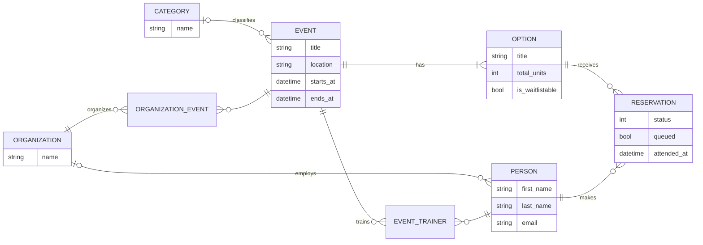
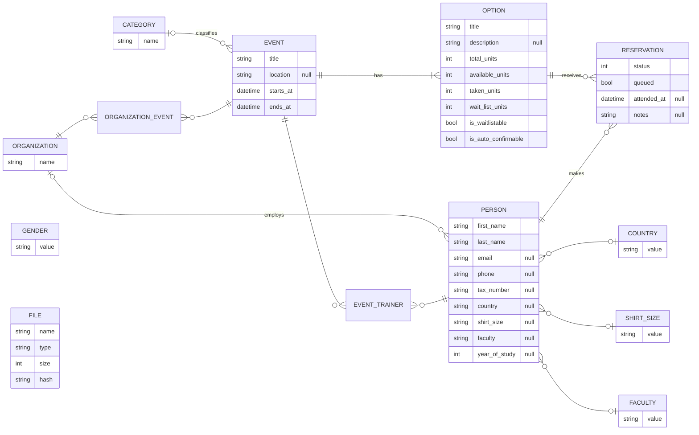
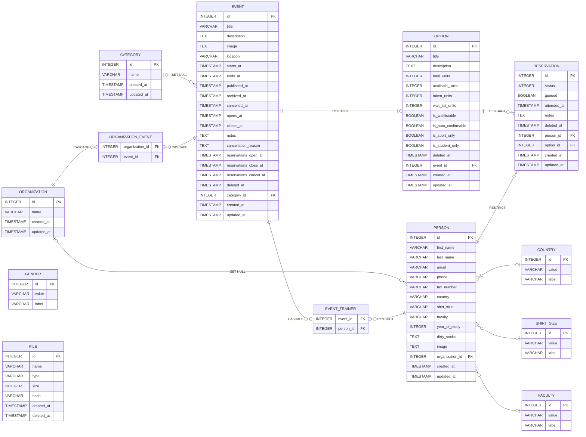

# Mermaid Dijagrami — UNIST Rezervacijski Sustav

## Generiranje slika

Zahtijeva `npx` (Node.js) i `ImageMagick`. Sve datoteke su u `images/diagrams/`.

```bash
# Sve se izvršava iz korijena projekta (dnrdb/)
CFG=images/diagrams/mermaid.config.json

# 1. Izvuci SVG-ove da dobiješ prirodne dimenzije
for slug in slika1-konceptualni slika2-logicki slika3-relacijski; do
  npx @mermaid-js/mermaid-cli \
    -i images/diagrams/${slug}.mmd \
    -o /tmp/${slug}.svg \
    -c $CFG -q
done

# 2. Ispiši dimenzije (koristi za -w i -H u koraku 3)
python3 -c "
import re
for slug in ['slika1-konceptualni','slika2-logicki','slika3-relacijski']:
    c = open(f'/tmp/{slug}.svg').read()[:400]
    m = re.search(r'viewBox=\"[\d.]+ [\d.]+ ([\d.]+) ([\d.]+)\"', c)
    if m:
        w,h = float(m.group(1)), float(m.group(2))
        print(f'{slug}: w={w:.0f} h={h:.0f}  → render -w {int(w)+40} -H {int(h)+40}')
"

# 3. Render PNG-ova (zadnje izmjerene dimenzije + 40px buffer, scale 3)
npx @mermaid-js/mermaid-cli -i images/diagrams/slika1-konceptualni.mmd \
  -o images/diagrams/slika1-konceptualni.png -c $CFG -s 3 -w 1748 -H 648 -q
npx @mermaid-js/mermaid-cli -i images/diagrams/slika2-logicki.mmd \
  -o images/diagrams/slika2-logicki.png    -c $CFG -s 3 -w 1851 -H 1186 -q
npx @mermaid-js/mermaid-cli -i images/diagrams/slika3-relacijski.mmd \
  -o images/diagrams/slika3-relacijski.png -c $CFG -s 3 -w 2403 -H 1903 -q

# 4. Autocrop rubnog bijelog prostora
for f in images/diagrams/*.png; do magick "$f" -trim +repage "$f"; done
```

> **Napomene:**
> - Izvorne `.mmd` datoteke i `mermaid.config.json` su u `images/diagrams/` — to su jedine datoteke potrebne za regeneraciju
> - `direction LR` mora biti unutar tijela `erDiagram` bloka (ne u `%%{init}%%` direktivi — to ne radi u v11)
> - Atributi entiteta moraju biti jedan po retku; Mermaid parser ne podržava `;` separator unutar `{ }`
> - Dimenzije (`-w`, `-H`) odgovaraju prirodnoj SVG veličini + 40px; ako se dijagram promijeni, ponovi korak 1–2 za nove dimenzije
> - GENDER i FILE nemaju stranog ključa pa layout engine ih smješta slobodno (donji lijevi kut)

---

## Slika 1 — Konceptualni dijagram



---

## Slika 2 — Logički model



---

## Slika 3 — Relacijski model


